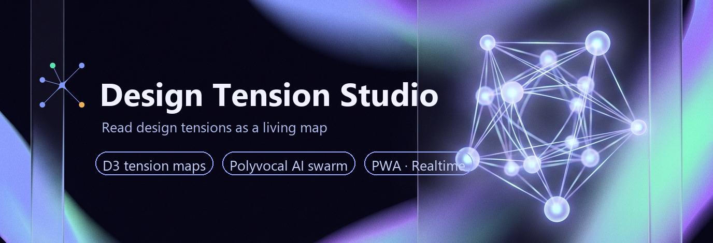
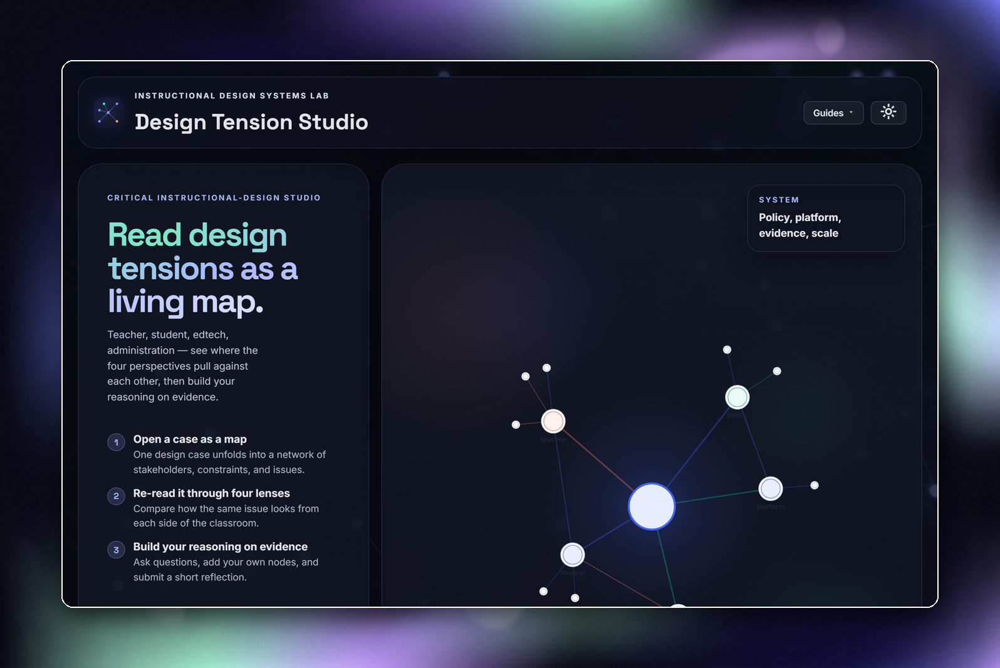
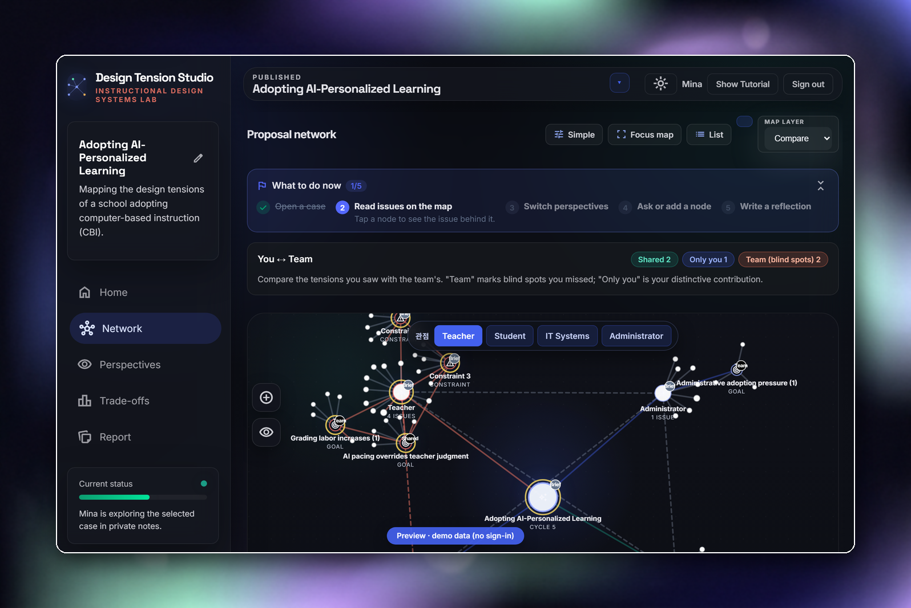
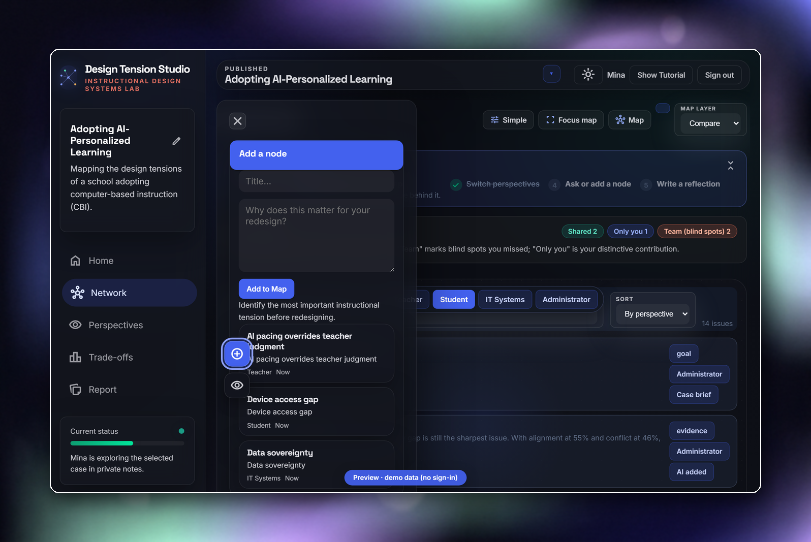
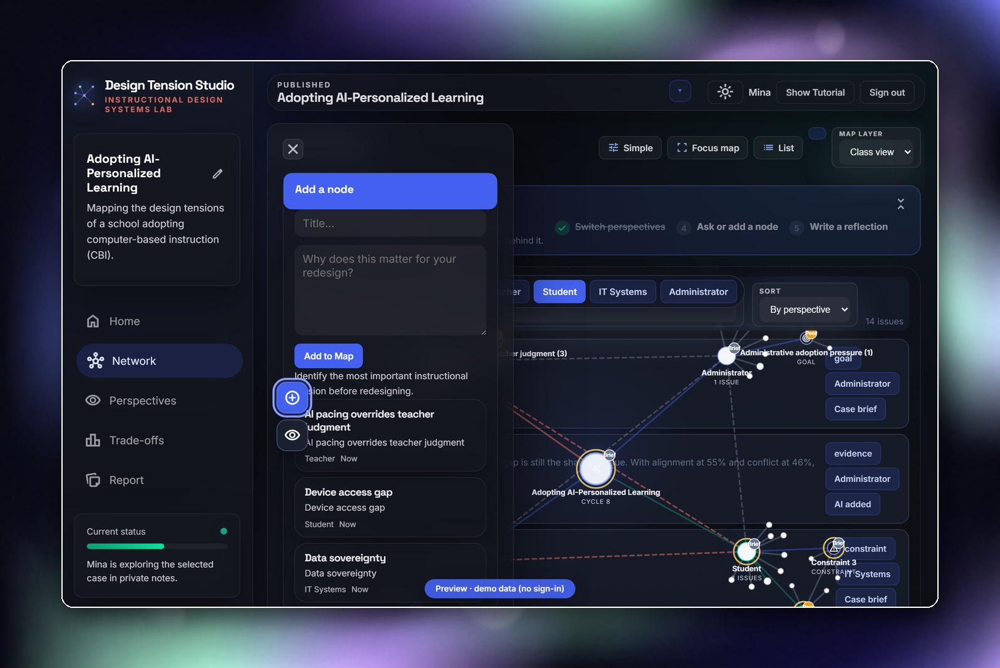
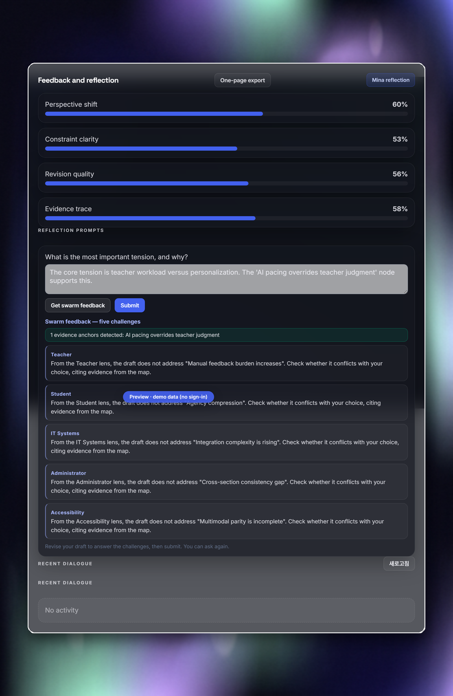
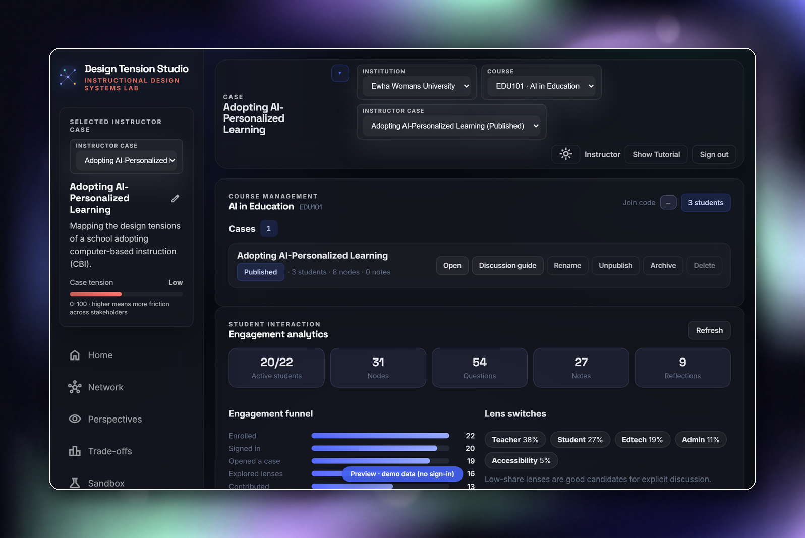

<p align="center">
  
</p>

<h1 align="center">Design Tension Studio</h1>

<p align="center">
  <strong>A critical instructional-design studio that reads design tensions as a living map.</strong><br/>
  An instructional design systems lab for seeing educational design as a sociotechnical problem.
</p>

<p align="center">
  <a href="https://swarm-id-en.pages.dev"><b>Live app</b></a> ·
  <a href="https://swarm-id-en.pages.dev/guides/student-en"><b>Student guide</b></a> ·
  <a href="https://swarm-id-en.pages.dev/guides/instructor-en"><b>Instructor guide</b></a> ·
  <a href="https://swarm-id-ko.pages.dev"><b>한국어판</b></a> ·
  <a href="https://dts-ko-preview.pages.dev"><b>No-login demo</b></a>
</p>

> **`main` is the English-default canonical branch**, deployed on Cloudflare Pages at
> swarm-id-en.pages.dev. The Korean-default twin lives on the `ko` branch
> (swarm-id-ko.pages.dev). Both share the same codebase and Supabase backend — they
> differ only in default locale, first-paint statics, and manifest.

---

## Screenshots

| | |
|---|---|
| **Landing** — 3-step product story + single auth card | **Student map** — "What to do now" banner + lens bar |
|  |  |
| **List view** — searchable companion to the map | **Class view** — peer issues aggregated, live updates |
|  |  |
| **Swarm critique** — five lenses challenge a draft | **My Course** — instructor case curation + analytics |
|  |  |

The guides embed **16 narrated screen recordings** (ElevenLabs voices) of these flows.

## What This Project Is For

Design Tension Studio was built around a simple premise: instructional design decisions are rarely only instructional. They are also organizational, infrastructural, political, ethical, and material. Instead of asking students to jump immediately to solutions, the studio helps them:

- inspect how goals, constraints, stakeholders, and evidence interact
- see design work as a network of tensions rather than a linear checklist
- develop a social materiality lens toward educational media and technology
- question how platforms, interfaces, data flows, policies, and human practices co-produce educational experience
- build design arguments with evidence, not just preference

In other words, this is not just a case viewer. It is a workspace for critical design reasoning.

## Core Experience

**Instructors** paste a course brief and the AI structures it into a case — stakeholders, constraints, and issues become a map. Publish it, share the join code, then curate everything from the **My Course** view: publish/archive/delete (with a guard that preserves student records), plus engagement analytics (funnel, lens distribution, per-student table).

**Students** join with a course code, get welcome slides + a guided tour on first visit, then follow the five-step **What to do now** banner: open a case → read issues by tapping nodes → switch lenses (teacher · student · edtech · administration) → ask the swarm or add their own nodes → submit a reflection. Map/list view toggle, class & compare layers (only-you vs only-team), touch-optimized for iPad with home-screen install (PWA).

**The swarm**: one question, five stakeholder agents answering in parallel — and when agents disagree, a **red edge** marks the spot on the map. Not a tutor that hands out answers; a polyvocal environment that surfaces tensions.

## AI-Assisted Feedback (research features)

Against the dominant single-tutor corrective paradigm, the studio implements **tension-preserving, polyvocal feedback**:

- **Swarm critique rounds** — five lenses challenge a student's reflection draft (no corrections, no praise) plus an automatic evidence-anchor check (does the draft cite map nodes?)
- **JOL calibration** — a one-tap "will they agree or split?" prediction before each question, scored against the actual disagreement classification
- **Full instrumentation** — `feedback.requested/shown`, extended `reflection.submit` (revision flag, draft snapshot, anchors before/after), `jol.predict/outcome`, `question.answer` (verbatim AI turns). Event dictionary and mining SQL: [docs/analytics_feedback_events.md](./docs/analytics_feedback_events.md)

## Critical Lens

The prototype helps students ask questions like:

- What assumptions about teachers, students, institutions, or data are embedded in this design?
- Which actors gain or lose agency when a system becomes more automated?
- What kinds of labor become hidden when a workflow is described as efficient?
- How do policy, platform architecture, accessibility, governance, and pedagogy shape one another?

The studio supports students in seeing educational media not as neutral delivery tools, but as part of a broader sociotechnical arrangement.

## Technical Stack

- Plain HTML/CSS/JS + **D3.js** force-directed tension maps
- **Supabase** — auth, course data, learner runs, append-only `analytics_events`, **Realtime** (live peer activity + presence)
- **OpenRouter** — case structuring, swarm replies, disagreement classification, critique rounds via the `_worker.js` Cloudflare Pages worker (model fallback chain absorbs provider rate limits) + deterministic local fallback
- **PWA** — manifest + network-first service worker (media bypassed), home-screen install, offline shell
- Hosting: Cloudflare Pages (`swarm-id-en` / `swarm-id-ko` / `dts-ko-preview`), wrangler direct-upload

## Data Model

Course-centered Supabase model: `profiles` · `institutions` · `courses` · `course_memberships` · `cases` · `documents` · `learner_runs` · `cohort_graph_snapshots` (+ `analytics_events`).

- instructor-authored cases remain canonical; learner work lives in `learner_runs`
- published/archived state controls learner visibility; cases with student activity can only be archived, never deleted from the UI
- schema & policies: [docs/supabase_schema.sql](./docs/supabase_schema.sql) · [docs/supabase_setup.md](./docs/supabase_setup.md)

## Local Development

```bash
# repo root
py -m http.server 8137
# real app:    http://127.0.0.1:8137/index.html
# demo data:   http://127.0.0.1:8137/preview.html  (no login; preview-demo.js injects a sample cohort)
node harness/run.js                        # logic tests
node scripts/smoke-usability-upgrade.mjs   # browser smoke (11 checks)
```

Guide regeneration pipeline (locale-parametrized — `GUIDE_LOCALE=en|ko`):
`node scripts/capture-ko-guides.mjs` (screenshots) → `node scripts/record-guide-videos.mjs` (recordings) → `py scripts/mux-guide-videos.py` (narration mux) → `node scripts/build-guides-html.mjs`. Narration scripts: `py scripts/generate-guide-narration.py` (KO) / `generate-guide-narration-en.py` (EN).

## Repository Guide

- [docs/analytics_feedback_events.md](./docs/analytics_feedback_events.md) — feedback instrumentation dictionary + mining SQL
- [docs/supabase_setup.md](./docs/supabase_setup.md) — backend setup (Realtime publication, case-delete policy)
- [guides/](./guides) — student/instructor guides (md → HTML build, with videos & narration)
- [scripts/](./scripts) — cohort seeding, guide capture/recording, E2E verification (`e2e-verify-feedback.mjs`)

## Who This Is For

Instructional designers, LX designers, edtech researchers, critical edtech scholars, HCI/CSCL researchers, and educators interested in studio-style design pedagogy.

## Collaboration Welcome

I am especially interested in feedback, collaboration, and critique around instructional design pedagogy, social materiality in education, network visualization for learning, and AI-assisted reflection. If this connects with your work, I would love to hear from you.
