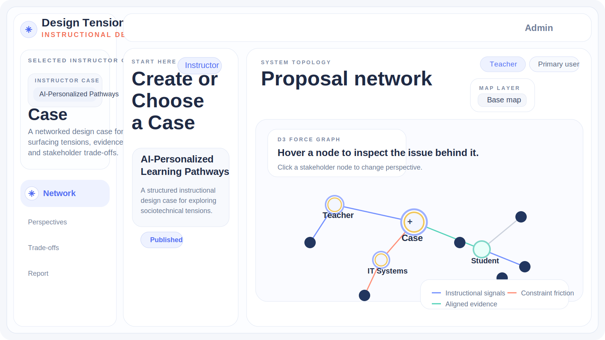

# Design Tension Studio

  <strong>An instructional design systems lab for seeing educational design as a sociotechnical problem.</strong>

  Design Tension Studio is a network-based learning environment where instructors turn course briefs into structured design cases, and students explore those cases through interactive D3 tension maps instead of static prompts. The project is designed to help learners identify trade-offs across pedagogy, governance, accessibility, infrastructure, agency, and institutional policy while developing a more critical understanding of educational media and technology.

  

## What This Project Is For

Design Tension Studio was built around a simple premise: instructional design decisions are rarely only instructional. They are also organizational, infrastructural, political, ethical, and material. In many classroom settings, students are asked to redesign a learning experience by focusing on efficiency, usability, or learning outcomes alone. This prototype aims to slow that move down.

Instead of asking students to jump immediately to solutions, the studio helps them:

- inspect how goals, constraints, stakeholders, and evidence interact
- see design work as a network of tensions rather than a linear checklist
- develop a social materiality lens toward educational media and technology
- question how platforms, interfaces, data flows, policies, and human practices co-produce educational experience
- build design arguments with evidence, not just preference

In other words, this is not just a case viewer. It is a workspace for critical design reasoning.

## Core Experience

The MVP is organized around two main roles.

### Instructor workflow

Instructors can:

- sign in and open their linked institution and course
- create or select a case
- paste a brief, syllabus, policy note, assignment prompt, or other source text
- turn that text into a structured case with goals, constraints, evidence, stakeholder signals, and board settings
- publish a case when it is ready for student exploration
- configure board conditions such as agenda prompt, due date, node limits, AI expansions, and layout mode

### Student workflow

Students can:

- sign in to their linked course
- see only the cases published to their course
- open the instructor-authored base map
- inspect nodes and links in the D3 network
- add agenda nodes, annotations, and learner-side reflections
- work in a private learner layer while keeping the instructor case canonical

### Cohort logic

The longer-term design direction supports three layers of activity:

1. Instructor base map
2. Learner private layer
3. Cohort synthesis layer

This structure allows instructors to publish the initial case, learners to interpret it through their own perspective, and the system to later synthesize class-level patterns without collapsing everything into one noisy shared graph.

## Why The Network Matters

The network view is not decoration. It is the instructional interface.

In the current prototype, the D3 topology is used to represent:

- the design proposal or case core
- stakeholder clusters
- constraints and friction points
- evidence traces
- learner-added agenda nodes
- AI-generated related nodes

This helps students understand that design decisions produce ripple effects. A change in personalization logic, privacy boundaries, or teacher workload is not isolated; it alters the broader system.

## Critical Lens

One of the main learning goals behind this project is to help students acquire a more critical stance toward educational technology.

The prototype is especially interested in helping students ask questions like:

- What assumptions about teachers, students, institutions, or data are embedded in this design?
- Which actors gain or lose agency when a system becomes more automated?
- How do interfaces and infrastructures shape what counts as a reasonable design move?
- What kinds of labor become hidden when a workflow is described as efficient?
- How do policy, platform architecture, accessibility, governance, and pedagogy shape one another?

This is where the social materiality orientation matters. The studio is intended to support students in seeing educational media not as neutral delivery tools, but as part of a broader sociotechnical arrangement.

## Product Structure

The current application includes:

- a branded landing page with sign-in and join paths
- role-aware instructor and learner workspaces
- institution, course, and case context controls
- a D3-powered proposal network
- stakeholder and lens switching
- structured case generation from uploaded text
- published case gating for learner visibility
- learner agenda nodes and annotations
- report and reflection surfaces
- Supabase-backed authentication and course data
- Gemini-backed generation paths with local fallback logic

## Data Model

The project uses Supabase as the operational backend and is organized around a course-centered model.

Main entities:

- `profiles`
- `institutions`
- `courses`
- `course_memberships`
- `cases`
- `documents`
- `learner_runs`
- `cohort_graph_snapshots`

Important design principles:

- instructor-authored cases remain canonical
- learner work happens in `learner_runs`
- published state controls learner visibility
- student accounts can be constrained to a single active course membership
- platform bootstrap can be handled by a root admin account

Schema and setup notes live in:

- [docs/supabase_schema.sql](./docs/supabase_schema.sql)
- [docs/supabase_setup.md](./docs/supabase_setup.md)

## AI In The Loop

The prototype is not built around chat for its own sake. Generation is used where it materially supports instructional reasoning.

Current and planned AI responsibilities include:

- structuring a pasted brief into a design case
- identifying goals, constraints, and stakeholder signals
- expanding learner-added agenda nodes into related issues
- generating question prompts and reflection prompts
- supporting instructor memo and learner reflection workflows

The intended direction is not to replace judgment, but to help surface relationships that might otherwise remain invisible.

## Technical Stack

- Plain HTML, CSS, and JavaScript
- D3.js for network visualization
- Supabase for auth and course-linked data
- Gemini integration for generative case and node expansion flows
- Vercel-friendly API routing for server-side generation paths

## Current Prototype Status

This is still an evolving MVP. Some parts are already working end-to-end, while others are still being hardened or extended.

Working areas include:

- role-aware sign-in and context loading
- instructor-side case creation and publishing
- student-side published-case visibility
- learner run persistence
- D3 visualization as the main case interface
- root admin bootstrap for institution and course setup

Still evolving:

- richer cohort-level synthesis
- stronger class/group collaboration workflows
- production-hardening around enrollment and roster management
- more sophisticated AI-driven graph generation
- improved report generation and assessment support

## Local Development

Open the project locally and serve the static files however you prefer.

Typical files:

- [index.html](./index.html)
- [styles.css](./styles.css)
- [app.js](./app.js)
- [api/gemini.js](./api/gemini.js)

To use the Supabase-backed flow:

1. Add your Supabase URL and publishable key in [supabase-config.js](./supabase-config.js)
2. Apply the schema in [docs/supabase_schema.sql](./docs/supabase_schema.sql)
3. Configure your memberships and course records
4. Add `GEMINI_API_KEY` for deployment if you want live generation

## Repository Guide

- [docs/prototype_gap_plan.md](./docs/prototype_gap_plan.md): design gaps and next-step planning
- [docs/harness_engineering.md](./docs/harness_engineering.md): test harness direction
- [docs/swarm_id_app_functions.md](./docs/swarm_id_app_functions.md): function-level notes

## Who This Is For

This project may be useful to:

- instructional designers
- learning experience designers
- education technology researchers
- critical edtech scholars
- HCI and CSCL researchers
- educators interested in studio-style design pedagogy
- collaborators building tools for reflective, systems-oriented learning

## Collaboration Welcome

I am especially interested in feedback, collaboration, and critique around:

- instructional design pedagogy
- social materiality and sociotechnical analysis in education
- critical educational media studies
- network visualization for learning
- AI-assisted reflection and case-based learning
- instructor workflows for publishing and moderating structured design cases

If this connects with your work, I would love to hear from you, test ideas together, or explore research and product directions collaboratively.
