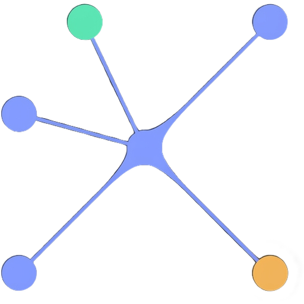
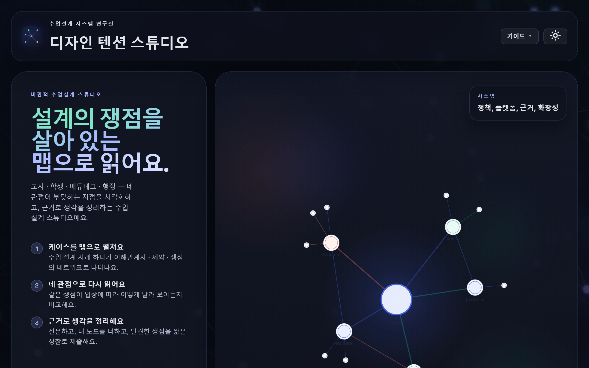
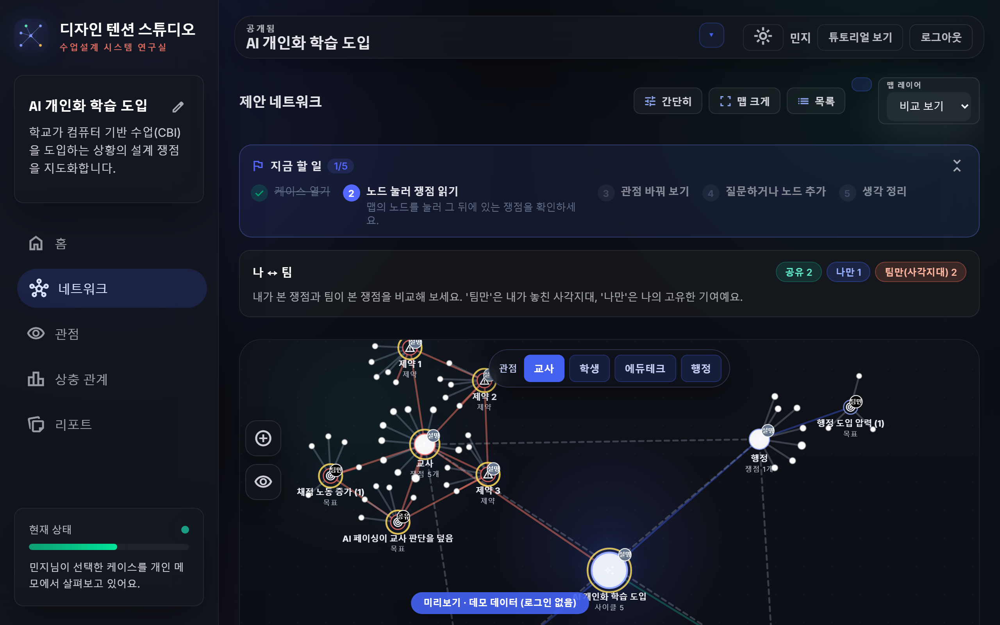
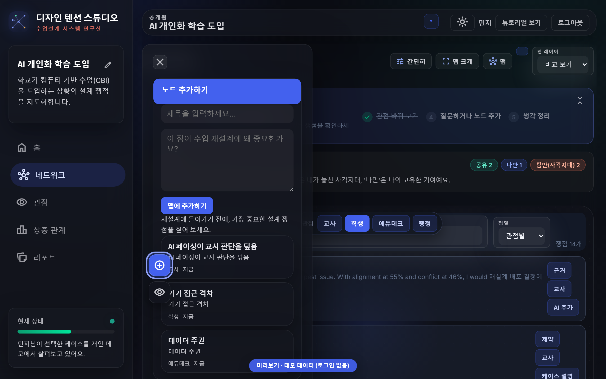
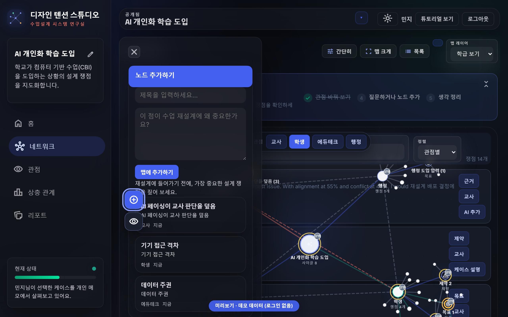
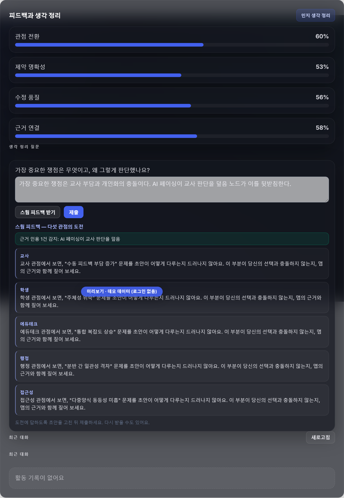
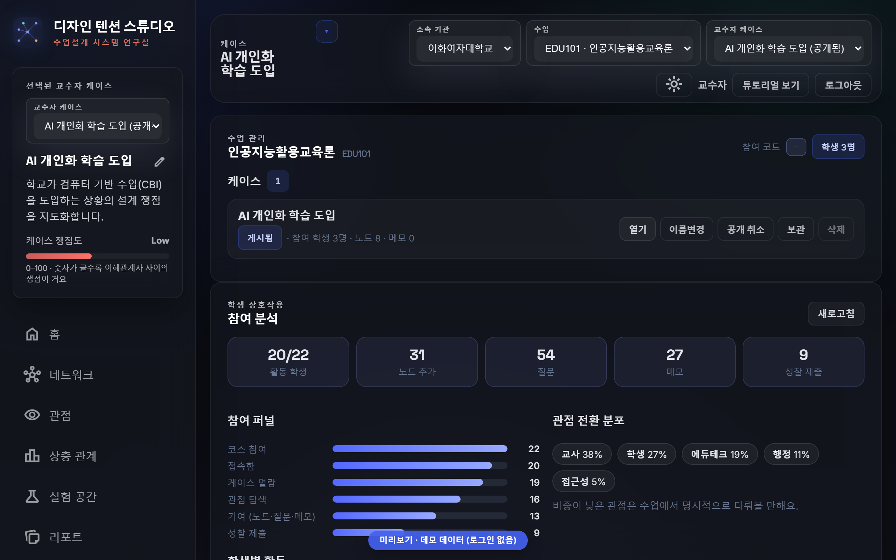

<p align="center">
  
</p>

<h1 align="center">디자인 텐션 스튜디오 (Design Tension Studio) — 한국어판</h1>

<p align="center">
  <strong>설계의 쟁점을 살아 있는 맵으로 읽는 비판적 수업설계 스튜디오</strong><br/>
  An instructional design systems lab for seeing educational design as a sociotechnical problem.
</p>

<p align="center">
  <a href="https://swarm-id-ko.pages.dev"><b>라이브 앱</b></a> ·
  <a href="https://dts-ko-preview.pages.dev"><b>무로그인 데모</b></a> ·
  <a href="https://swarm-id-ko.pages.dev/guides/student-ko"><b>학생 가이드</b></a> ·
  <a href="https://swarm-id-ko.pages.dev/guides/instructor-ko"><b>교수자 가이드</b></a>
</p>

> **이 `ko` 브랜치는 한국어 기본(Korean-default) 버전입니다.** 영어 원본은 `main` 브랜치
> (swarmid.vercel.app)를 참고하세요. 두 브랜치는 같은 Supabase 백엔드를 공유하며,
> `ko`는 한국어 UI·홈 대시보드·사용성 업그레이드·PWA·실시간 협업·AI 피드백 연구
> 기능이 먼저 적용되는 선행 브랜치입니다.

---

## 스크린샷

| | |
|---|---|
| **랜딩** — 3단계 제품 스토리 + 단일 인증 카드 | **학생 맵** — "지금 할 일" 5단계 배너 + 관점 바 |
|  |  |
| **목록 보기** — 맵의 보조 뷰 (검색·4종 정렬) | **학급 보기** — 동료 쟁점 집계 + 실시간 반영 |
|  |  |
| **스웜 비평** — 5관점이 초안에 도전 질문 | **내 수업** — 교수자 케이스 관리 + 참여 분석 |
|  |  |

가이드 페이지에는 위 화면들의 **나레이션 포함 스크린 레코딩 16편**(ElevenLabs 한국어 음성)이 들어 있습니다.

## What This Project Is For

Design Tension Studio was built around a simple premise: instructional design decisions are rarely only instructional. They are also organizational, infrastructural, political, ethical, and material. Instead of asking students to jump immediately to solutions, the studio helps them:

- inspect how goals, constraints, stakeholders, and evidence interact
- see design work as a network of tensions rather than a linear checklist
- develop a social materiality lens toward educational media and technology
- question how platforms, interfaces, data flows, policies, and human practices co-produce educational experience
- build design arguments with evidence, not just preference

In other words, this is not just a case viewer. It is a workspace for critical design reasoning.

## Core Experience

**교수자**: 수업 브리프를 붙여넣으면 AI가 이해관계자·제약·쟁점이 추출된 구조화 케이스로 변환 → 게시 → **내 수업** 화면에서 참여 코드 공유, 케이스 게시/보관/삭제(학생 활동 보존 가드), 참여 퍼널·관점 분포·학생별 활동 분석.

**학생**: 코스 코드로 참여 → 첫 방문 웰컴 슬라이드 + 가이드 투어 → **지금 할 일** 5단계 배너를 따라 ① 케이스 열기 ② 노드 눌러 쟁점 읽기 ③ 교사·학생·에듀테크·행정 관점 전환 ④ 질문(스웜 라운드)·내 노드 추가 ⑤ 생각 정리 제출. 맵/목록 보기 전환, 학급 보기·비교 보기(나만/팀만/공유), iPad 터치 최적화 + 홈 화면 설치(PWA).

**스웜 AI**: 질문 하나에 다섯 이해관계자 에이전트가 동시에 답하고, 에이전트 간 **이견은 빨간 엣지**로 맵에 표시됩니다. 정답을 주는 튜터가 아니라, 긴장을 드러내는 다성적(polyvocal) 환경입니다.

## AI-Assisted Feedback (연구 기능)

단일 튜터의 교정 피드백 패러다임 대신 **tension-preserving, polyvocal feedback**을 구현합니다:

- **스웜 비평 라운드** — 생각 정리 초안에 다섯 관점이 교정/칭찬 없이 도전 질문만 던지고, 초안이 맵 노드를 근거로 인용했는지 자동 점검(evidence-anchor check)
- **JOL 캘리브레이션** — 질문 전 "동의할까, 갈릴까?" 1탭 예측 → 실제 이견 분류와 대조
- **전 과정 계측** — `feedback.requested/shown`, `reflection.submit`(수정 여부·초안 스냅샷·앵커 전후), `jol.predict/outcome`, `question.answer`(AI 턴 원문) → 이벤트 사전과 마이닝 SQL은 [docs/analytics_feedback_events.md](./docs/analytics_feedback_events.md)

## Critical Lens

The prototype helps students ask questions like:

- What assumptions about teachers, students, institutions, or data are embedded in this design?
- Which actors gain or lose agency when a system becomes more automated?
- What kinds of labor become hidden when a workflow is described as efficient?
- How do policy, platform architecture, accessibility, governance, and pedagogy shape one another?

The studio is intended to support students in seeing educational media not as neutral delivery tools, but as part of a broader sociotechnical arrangement.

## Technical Stack

- Plain HTML/CSS/JS + **D3.js** force-directed tension maps
- **Supabase** — auth, course data, learner runs, append-only `analytics_events`, **Realtime** (동료 활동 라이브 반영 + 프레즌스)
- **Gemini** — case structuring, swarm replies, disagreement classification, critique rounds (배포별 프록시: Vercel `api/gemini.js`, Cloudflare `_worker.js`) + 결정론적 로컬 폴백
- **PWA** — manifest + network-first service worker(미디어 우회), 홈 화면 설치, 오프라인 셸
- 배포: Cloudflare Pages (`swarm-id-ko` 본판 / `dts-ko-preview` 데모), wrangler direct-upload

## Data Model

Course-centered Supabase model: `profiles` · `institutions` · `courses` · `course_memberships` · `cases` · `documents` · `learner_runs` · `cohort_graph_snapshots` (+ `analytics_events`).

- instructor-authored cases remain canonical; learner work lives in `learner_runs`
- published/archived state controls learner visibility; cases with student activity can only be archived, never deleted from the UI
- schema & policies: [docs/supabase_schema.sql](./docs/supabase_schema.sql) · [docs/supabase_setup.md](./docs/supabase_setup.md)

## Local Development

```bash
# repo root
py -m http.server 8137
# real app:    http://127.0.0.1:8137/index.html
# demo data:   http://127.0.0.1:8137/preview.html  (no login, preview-demo.js injects a sample cohort)
node harness/run.js                        # logic tests
node scripts/smoke-usability-upgrade.mjs   # browser smoke (11 checks)
```

가이드 재생성 파이프라인: `node scripts/capture-ko-guides.mjs`(스크린샷) → `node scripts/record-guide-videos.mjs`(녹화) → `py scripts/mux-guide-videos.py`(나레이션 합성) → `node scripts/build-guides-html.mjs`. 나레이션 대본/재생성: `py scripts/generate-guide-narration.py`.

## Repository Guide

- [docs/analytics_feedback_events.md](./docs/analytics_feedback_events.md) — 피드백 계측 이벤트 사전 + 마이닝 SQL
- [docs/ko-glossary.md](./docs/ko-glossary.md) — 한국어 용어 기준표
- [docs/supabase_setup.md](./docs/supabase_setup.md) — 백엔드 셋업 (Realtime publication, 케이스 삭제 정책 포함)
- [guides/](./guides) — 학생/교수자 가이드 (md → HTML 빌드, 영상·나레이션 포함)
- [scripts/](./scripts) — 코호트 시딩, 가이드 캡처/녹화, E2E 검증(`e2e-verify-feedback.mjs`)

## Who This Is For

Instructional designers, LX designers, edtech researchers, critical edtech scholars, HCI/CSCL researchers, and educators interested in studio-style design pedagogy.

## Collaboration Welcome

I am especially interested in feedback, collaboration, and critique around instructional design pedagogy, social materiality in education, network visualization for learning, and AI-assisted reflection. If this connects with your work, I would love to hear from you.
