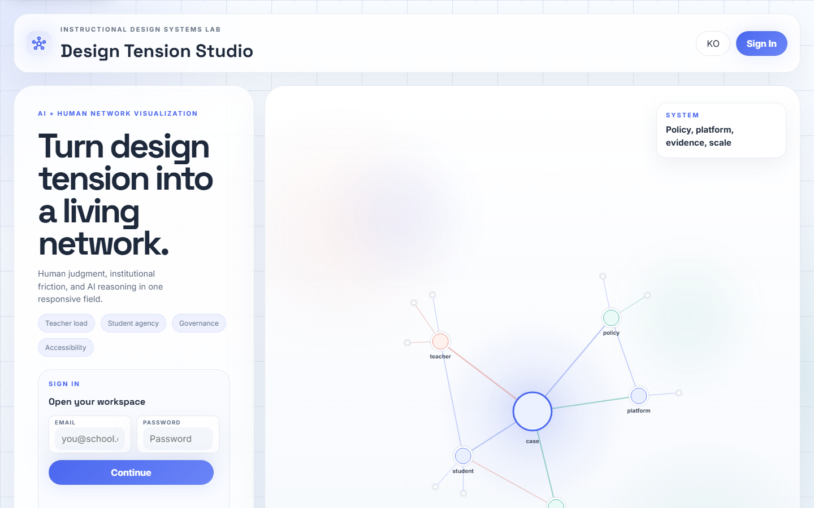
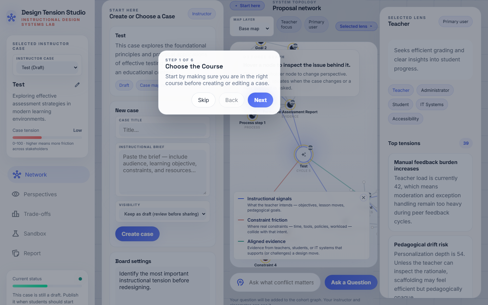
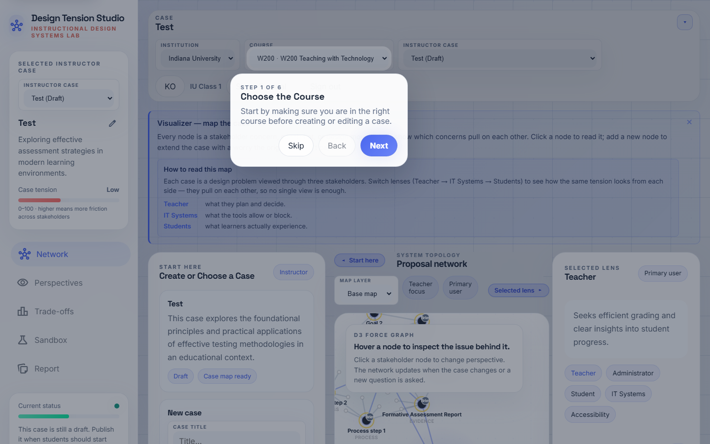
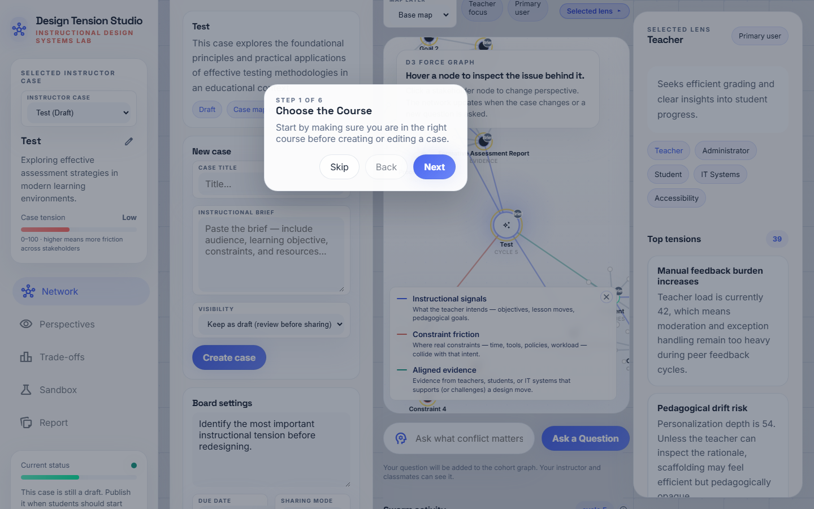
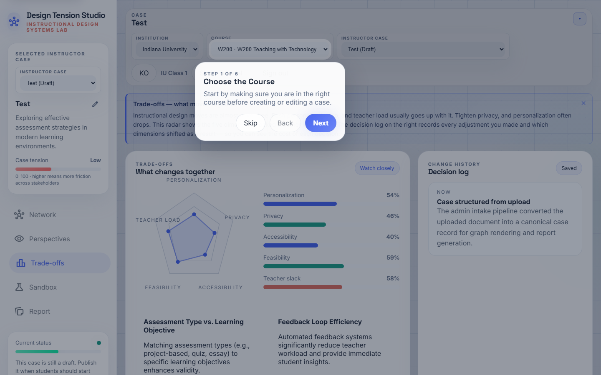
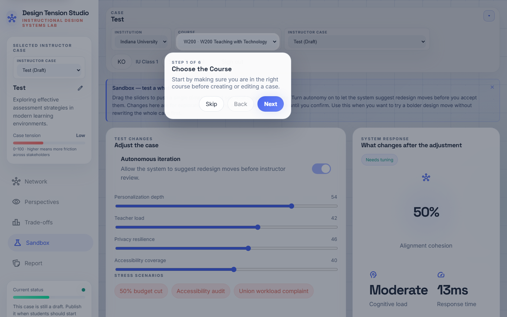

# Swarm_ID — Instructor Guide (English)

A step-by-step walkthrough for instructors preparing Swarm_ID for an
instructional-design class. Each step shows what you will see, what to
click, and what the underlying mechanic is doing in the background.

> **What makes Swarm_ID different.** When a student asks a question,
> Swarm_ID does **not** call an LLM once. It launches a *swarm round* —
> five stakeholder agents (teacher, student, IT, administrator,
> accessibility) answer the same question **in parallel**. A second pass
> classifies every pair of answers as **agree / disagree / tangential**
> and draws the result onto the network. Students see pluralism, conflict,
> and convergence at a glance, then can "Challenge" any single lens to
> push for a refined second-round response. Every node on the map carries
> a provenance badge (`AI`, `Me`, `Peer`, `Brief`) so the class never
> loses track of who wrote what.

---

## Step 1 · Sign in

Open **https://swarmid.vercel.app** and sign in with your instructor
account (Supabase-backed). If you do not have an account yet, ask your
platform admin to create one — self-signup is disabled on purpose so
course data stays inside the institution.

**What the system is doing:** authenticating you against Supabase and
hydrating your institution + course context. Locally cached state (recent
cases, tutorial progress) is also restored from `localStorage`.

---

## Step 2 · Studio landing

You land on the **Case Network** view in the Studio. The left sidebar
shows navigation (Network · Perspectives · Trade-offs · Sandbox · Report)
and the **Current status** health panel. The canvas center holds the
D3 force-directed map. The right sidebar shows your **Selected lens**
and **Swarm activity** feed.

**Tip.** The pill next to "Swarm activity" now reads
`cycle N · round M`. `cycle` counts graph re-renders; `round` counts
genuine multi-agent turns. After a class run, `round` should be well
above zero — that is your proof the students engaged the swarm.

---

## Step 3 · Review the case library

Scroll the **Start here** (intake) panel to see the **Course cases** list.
Each card shows title, summary, draft/published state, and Open / Publish
buttons. Cards with **Published** are visible to your students; **Draft**
cases are instructor-only.

**Housekeeping:** If students complain they cannot find a case, the most
common cause is that it is still in Draft. One click on **Publish** fixes
it.

---

## Step 4 · Open a case

Click **Open case** on the one you want to use in class (e.g. *Online
Digital Literacy Module for 5th Graders*). The canvas re-renders with:

- A central **core** node carrying the case title.
- Stakeholder nodes (Teacher, Student, IT, Administrator, Accessibility)
  orbiting the core.
- Signal nodes (goals, constraints, evidence) connected to the
  relevant stakeholders.

Every major node carries a small **provenance badge** in its top-right
corner — `Brief` means the node came from the uploaded case brief.

---

## Step 5 · Upload / structure a new brief

If you need a new case for this class session, paste the brief into the
**Paste the case brief** textarea in the intake panel and hit
**Structure the case**. The system calls Gemini to extract goals,
constraints, stakeholders, and seed evidence into the case record and
drops the result in the case list as a Draft.

**Pedagogical note.** Brief quality directly shapes swarm quality.
Include: target audience, learning objectives (ADDIE / 5E friendly
language works well), constraints (time, tools, policies, workload),
and at least one known tension (e.g. "authorship policy vs AI-assisted
drafting"). The more tension you encode, the richer the disagreement
edges the swarm will draw.

---

## Step 6 · Board settings

Open **Settings** to configure the cohort board. Key knobs:

- **Max learner nodes** — caps how many agenda nodes a single student
  can add to their personal map.
- **Max AI expansions per node** — caps how many follow-ups Gemini can
  auto-generate under any one student node.
- **Governance gate / Accessibility gate** — optional review gates
  before learners can publish a decision.

Defaults are safe for a 30-student section. Lower these if you want a
tighter, more deliberate class.

---

## Step 7 · Perspectives

Click **Perspectives** in the left nav. You now see a per-stakeholder
digest of top conflicts, with quantitative tension scores. This is the
best view to use in a lecture to walk through "what each lens is worried
about" before the class runs their own swarm rounds.

**Classroom prompt:** *"If the Teacher score is 74 and the Student score
is 58, which stakeholder is currently carrying more load, and why do the
constraints make that so?"*

---

## Step 8 · Trade-offs

The **Trade-offs** view shows a radar (personalization / privacy /
accessibility / feasibility / teacher slack) and bar charts. The
**Matrix state** label flags *Needs attention*, *Watch closely*, or
*Balanced*.

Use this view as the checkpoint between activity phases. "Where is
conflict spiking?" is a good sensemaking prompt for the whole cohort.

---

## Step 9 · Sandbox

**Sandbox** lets you apply preset scenarios — *budget*, *accessibility*,
*workload* — and watch how the metrics redistribute. You can also
toggle **autonomous iteration** to let the system keep shuffling
conflicts until it settles.

This is the best view for "what if" exercises: apply a scenario, let
students predict where tension will land, reveal, discuss.

---

## Step 10 · Report & export

**Report** assembles decisions, evidence, and memos into a shareable
summary. Use **Download PNG** to grab the network as an image for a
slide; **Download HTML** gives a standalone snapshot students can keep.

**After class.** Peek at **Swarm activity** — the `round` counter tells
you whether the cohort genuinely engaged the 5-agent swarm or just
browsed. A class that produced 30+ rounds across 30 students is
engaged; one with only 5 rounds likely needs more explicit prompting.

---

## Troubleshooting

| Symptom | Likely cause | Fix |
|---|---|---|
| Students can't see a case | Case is Draft | Click **Publish** on the card |
| Network feels empty even after questions | Students didn't submit, or Gemini key not set | Check `/api/gemini` logs in Vercel |
| Disagreement edges never appear | Second Gemini pass failed silently | Open browser console — look for `classifySwarmEdges` warnings |
| Korean / English mixed in UI | Locale toggle mid-render | Click the locale button twice to force a full re-render |
| Left sidebar content cut off | Viewport height too small | Sidebar scrolls independently — drag the inner content |

---

## Quick preflight before class

1. All case cards you need are **Published**.
2. Board settings set (Max learner nodes ≥ 6 for a 50-min session).
3. You have opened the class case yourself at least once (this warms the
   cache and catches Gemini quota issues).
4. Your projector / screen share window shows the Network view at full
   width — collapse both side panels via the chevrons so the map fills
   the canvas when demonstrating.
5. Review the Student guide (`student-en.md` / `student-ko.md`) so you
   know exactly what your class will see.
