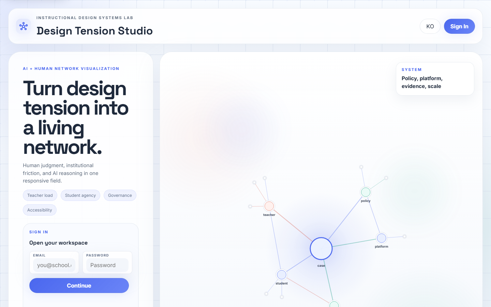
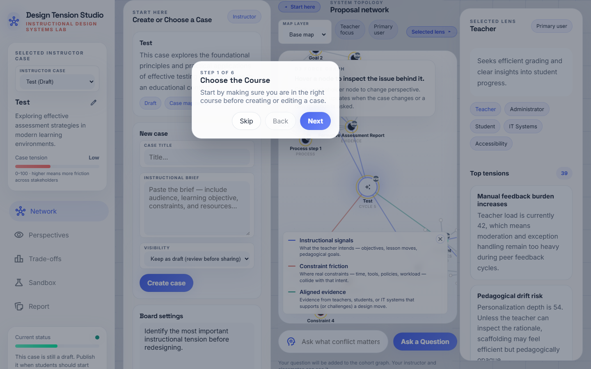
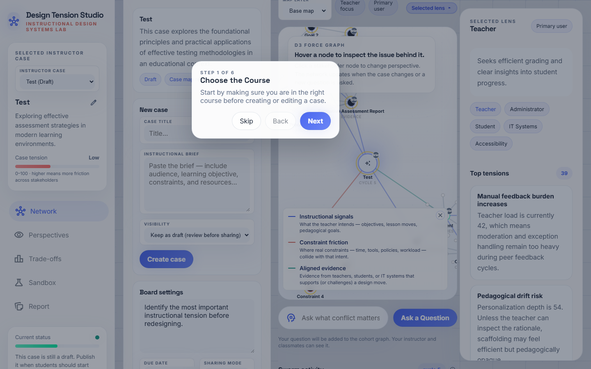
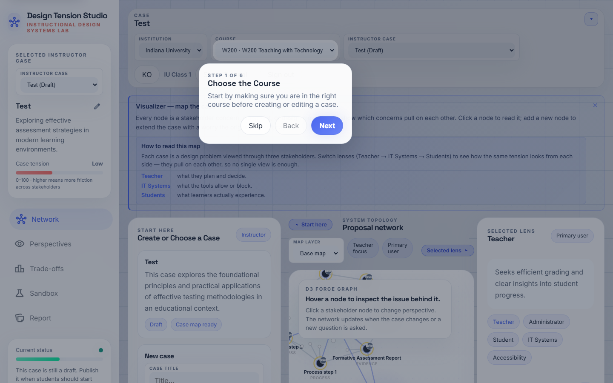
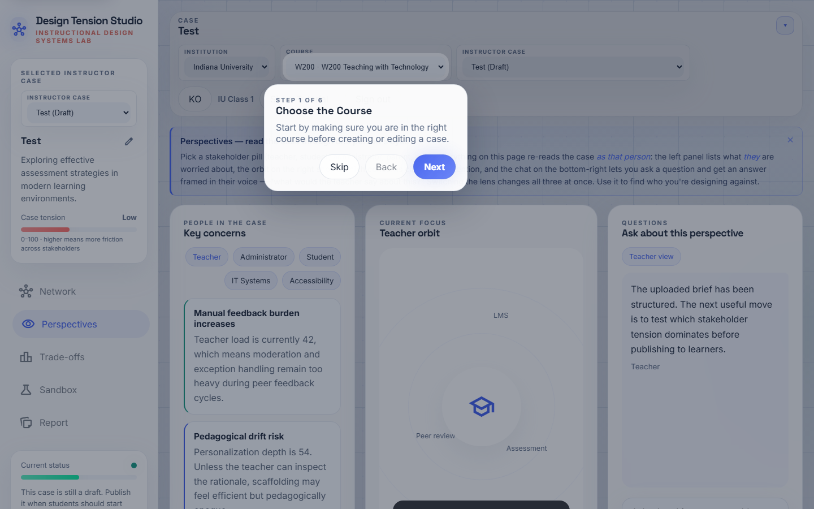
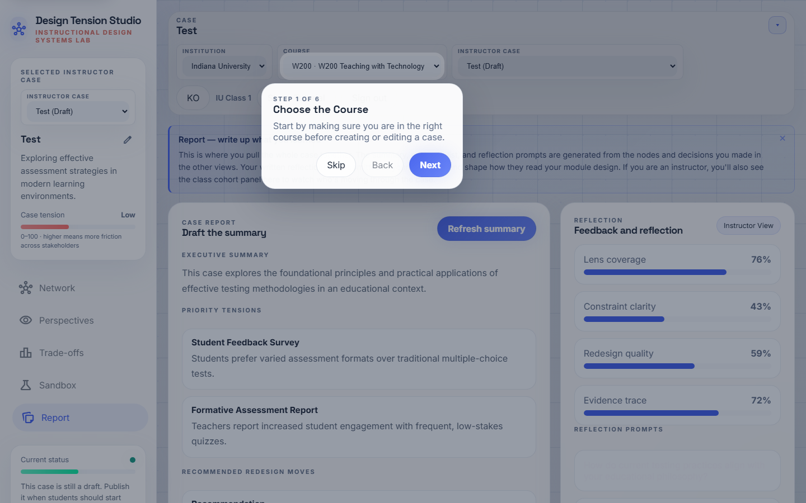

# Swarm_ID — 강사용 가이드 (한국어)

수업용 Swarm_ID 준비를 위한 단계별 안내서입니다. 각 스텝은
**무엇이 보이는지**, **어디를 클릭하는지**, 그리고 **시스템이
어떤 일을 하고 있는지**를 함께 설명합니다.

> **Swarm_ID가 다른 이유.** 학생이 질문하면 Swarm_ID는 LLM을
> 한 번만 호출하지 않습니다. 대신 **스웜 라운드**를 실행합니다 —
> 다섯 명의 이해관계자 에이전트(교사·학생·IT·행정·접근성)가
> 같은 질문에 **동시에** 답합니다. 두 번째 패스는 답변 쌍을
> **동의 / 이견 / 부분일치**로 분류해 네트워크 위에 그려 줍니다.
> 학생은 다원성·충돌·합의 지점을 한눈에 보고, 특정 관점에 대해
> "Challenge"를 누르면 해당 에이전트가 2라운드 응답으로 정교화
> 합니다. 맵의 모든 주요 노드에는 출처 배지(`AI`, `나`, `동료`,
> `설명`)가 달려 있어 누가 쓴 내용인지 항상 추적 가능합니다.

---

## Step 1 · 로그인

**https://swarmid.vercel.app** 에 접속해 강사 계정으로 로그인합니다
(Supabase 기반). 아직 계정이 없다면 플랫폼 관리자에게 요청하세요 —
강의 데이터를 기관 내부에 보호하기 위해 자가 가입은 의도적으로
비활성화되어 있습니다.

**내부 동작:** Supabase에 인증한 뒤 기관·강의 컨텍스트를 불러옵니다.
최근 케이스, 튜토리얼 진행 상태 등 로컬 캐시도 `localStorage`에서
복원됩니다.

---

## Step 2 · 스튜디오 진입

스튜디오의 **케이스 네트워크** 뷰로 진입합니다. 왼쪽 사이드바에는
네비게이션(네트워크 · 관점 · 트레이드오프 · 샌드박스 · 리포트)과
**현재 상태** 건강 패널이 있습니다. 중앙 캔버스에 D3 힘 지향
그래프, 오른쪽 사이드바에는 **선택된 렌즈**와 **스웜 활동** 피드가
표시됩니다.

**팁.** "스웜 활동" 옆 알약 라벨은 이제
`사이클 N · 라운드 M` 으로 표시됩니다. `사이클`은 그래프 리렌더
횟수, `라운드`는 실제 다중 에이전트 턴 수를 셉니다. 수업이 끝난 뒤
`라운드`가 충분히 0보다 커야 학생들이 스웜에 실제로 참여했다는
증거가 됩니다.

---

## Step 3 · 케이스 라이브러리 점검

**시작하기**(인테이크) 패널을 스크롤해 **강의 케이스** 목록을
확인하세요. 카드마다 제목·요약·초안/게시 상태·열기/게시 버튼이
보입니다. **게시됨**이 붙은 카드는 학생에게 노출되고, **초안**
카드는 강사 전용입니다.

**관리 팁.** 학생이 케이스를 못 찾는 가장 흔한 원인은 **초안**
상태로 남아 있기 때문입니다. 카드의 **게시** 버튼을 한 번 누르면
해결됩니다.

---

## Step 4 · 케이스 열기

수업에 사용할 케이스(예: *5학년 온라인 디지털 리터러시 모듈*)의
**케이스 열기** 버튼을 누르면 캔버스가 재렌더됩니다:

- 케이스 제목을 담은 중앙 **코어** 노드
- 코어를 둘러싼 이해관계자 노드(교사·학생·IT·행정·접근성)
- 각 이해관계자에 연결된 시그널 노드(목표·제약·증거)

모든 주요 노드에는 오른쪽 위에 작은 **출처 배지**가 붙습니다 —
`설명`이면 업로드된 수업 설명요약에서 나온 노드라는 뜻입니다.

---

## Step 5 · 새 설명요약 업로드 / 구조화

이번 수업에 새 케이스가 필요하면, 인테이크 패널의
**수업 설명요약을 붙여 넣으세요** 텍스트 영역에 설명요약을 넣고
**케이스 구조화**를 누르세요. 시스템이 Gemini를 호출해 목표·
제약·이해관계자·시드 증거를 추출하고 케이스 레코드에 넣은 뒤
목록에 **초안**으로 올려 둡니다.

**교수학습 팁.** 설명요약 품질이 곧 스웜 품질입니다. 다음을 포함
하세요: 대상 학습자, 학습 목표(ADDIE / 5E 친화적 언어), 제약(시간·
도구·정책·워크로드), 최소 한 가지 긴장 지점(예: "저작 정책 vs
AI 보조 드래프팅"). 긴장이 많이 인코딩될수록 스웜이 그리는 **이견
엣지**가 더 풍부해집니다.

---

## Step 6 · 보드 설정

**설정**을 열어 코호트 보드를 구성하세요. 핵심 노브:

- **학습자 노드 최대 개수** — 학생 한 명이 개인 맵에 추가할 수
  있는 아젠다 노드 수 상한.
- **노드당 AI 확장 최대 개수** — Gemini가 특정 학생 노드 아래에
  자동 생성할 후속 개수 상한.
- **거버넌스 게이트 / 접근성 게이트** — 학습자가 결정을 게시
  하기 전 리뷰 게이트 설정(선택).

기본값은 30명 섹션에 안전합니다. 더 짧고 신중한 수업을 원하면
값을 낮추세요.

---

## Step 7 · 관점 (Perspectives)

왼쪽 내비게이션의 **관점**을 클릭합니다. 이해관계자별 상위 충돌
요약과 정량적 긴장 점수가 표시됩니다. 학생이 스스로 스웜 라운드를
돌리기 전에, 강의에서 "각 렌즈가 지금 무엇을 걱정하는가"를 짚기
좋은 뷰입니다.

**교실용 발문 예:** *"교사 점수가 74이고 학생 점수가 58이라면,
지금 어느 이해관계자가 더 부담을 짊어지고 있고, 왜 제약이
그렇게 만들었을까?"*

---

## Step 8 · 트레이드오프

**트레이드오프** 뷰는 레이더(개인화 / 프라이버시 / 접근성 /
실현가능성 / 교사 여유)와 바 차트를 보여 줍니다. **매트릭스 상태**
라벨은 *주의 필요*, *경계*, *균형* 중 하나를 표기합니다.

활동 단계 사이의 체크포인트로 활용하세요. "지금 어디서 충돌이
튀어 오르는가?"는 코호트 전체용 메타인지 프롬프트로 좋습니다.

---

## Step 9 · 샌드박스

**샌드박스**에서는 사전 정의된 시나리오(*예산 · 접근성 · 워크로드*)
를 적용해 지표가 어떻게 재분배되는지 관찰할 수 있습니다. **자율
반복**을 켜면 시스템이 안정 상태에 이를 때까지 충돌을 계속
셔플합니다.

"만약에" 연습에 가장 적합한 뷰입니다. 시나리오 적용 → 학생이
긴장이 어디로 이동할지 예측 → 공개 → 토의 순서.

---

## Step 10 · 리포트 & 내보내기

**리포트**는 결정·증거·메모를 하나의 공유 가능한 요약으로
조립합니다. **PNG 다운로드**는 슬라이드용 네트워크 이미지,
**HTML 다운로드**는 학생이 간직할 수 있는 독립형 스냅샷을
제공합니다.

**수업 후.** **스웜 활동**을 한번 더 확인하세요 — `라운드` 카운터는
코호트가 5-에이전트 스웜에 실제로 개입했는지, 아니면 단순히
브라우징만 했는지 보여 줍니다. 학생 30명이 30라운드 이상 만든
수업은 활발한 참여, 5라운드 정도에 그친 수업은 더 명시적인
프롬프팅이 필요합니다.

---

## 문제 해결

| 증상 | 원인 추정 | 조치 |
|---|---|---|
| 학생이 케이스를 못 봄 | 초안 상태 | 카드의 **게시** 클릭 |
| 질문 후에도 네트워크가 비어 있음 | 학생이 제출 안 함 / Gemini 키 미설정 | Vercel의 `/api/gemini` 로그 확인 |
| 이견 엣지가 전혀 안 나타남 | 2차 Gemini 패스가 조용히 실패 | 브라우저 콘솔에서 `classifySwarmEdges` 경고 확인 |
| UI에 한/영이 섞임 | 렌더 도중 로케일 전환 | 로케일 버튼을 두 번 눌러 전체 리렌더 강제 |
| 왼쪽 사이드바 내용 잘림 | 뷰포트 높이 부족 | 사이드바는 독립 스크롤 — 내부 콘텐츠를 드래그 |

---

## 수업 직전 프리플라이트

1. 사용할 모든 케이스 카드가 **게시됨** 상태.
2. 보드 설정 완료 (50분 수업 기준 **학습자 노드 최대 개수 ≥ 6**).
3. 강사 본인이 수업용 케이스를 최소 한 번은 열어 봄 (캐시 워밍 +
   Gemini 쿼터 이슈 선검출).
4. 프로젝터/화면 공유 창이 네트워크 뷰를 전폭으로 표시 —
   시연 시 두 사이드 패널을 쉐브론으로 접어 맵이 캔버스를 채우게
   한다.
5. 학생 가이드(`student-en.md` / `student-ko.md`)를 미리 읽어
   학생이 보게 될 화면을 정확히 파악해 둔다.
