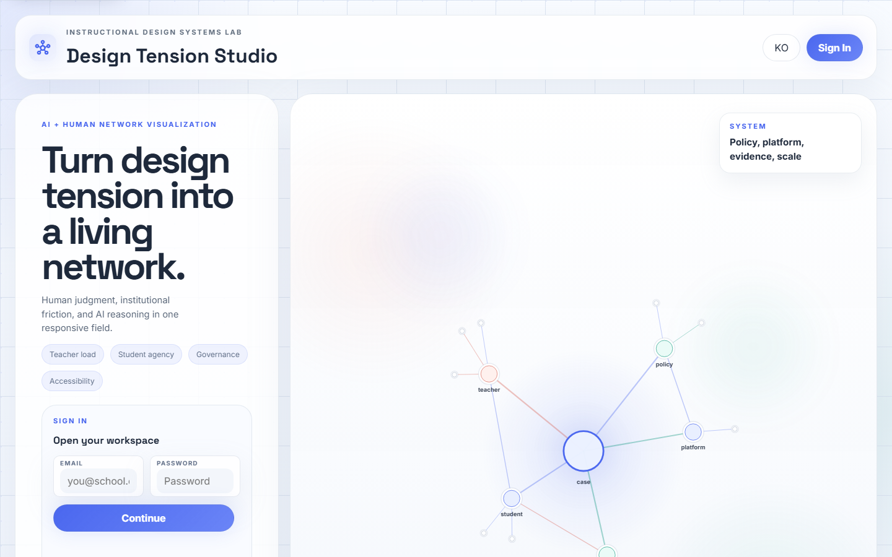
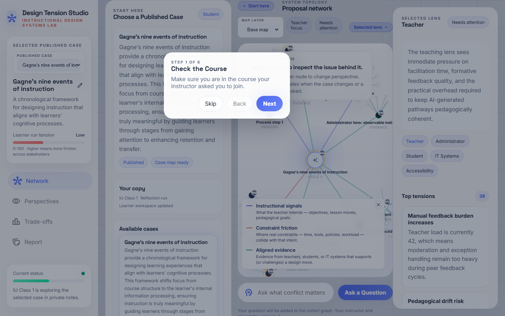
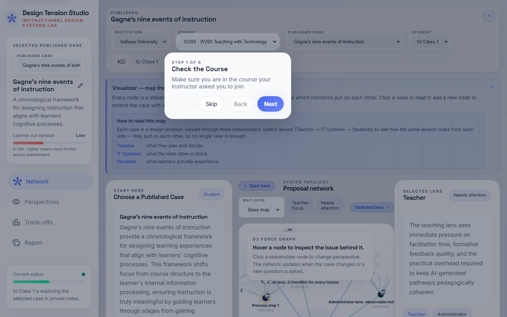
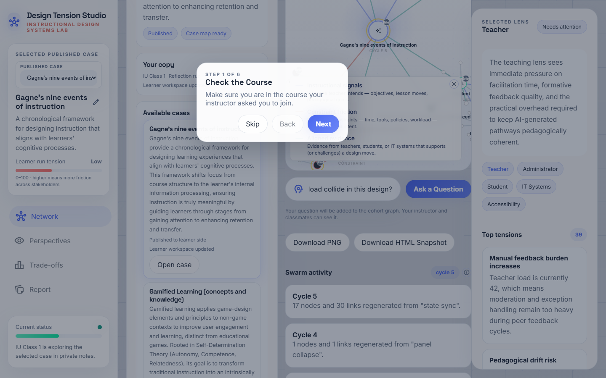
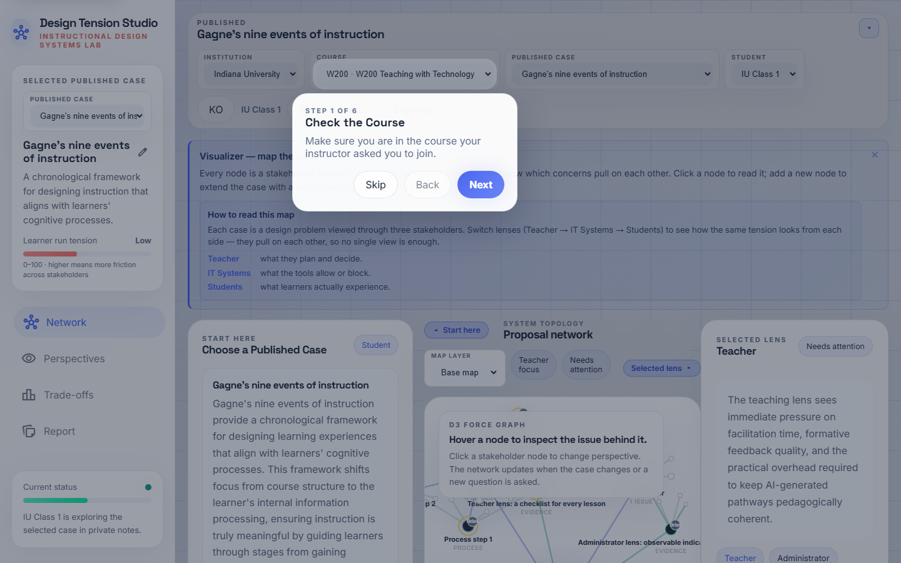
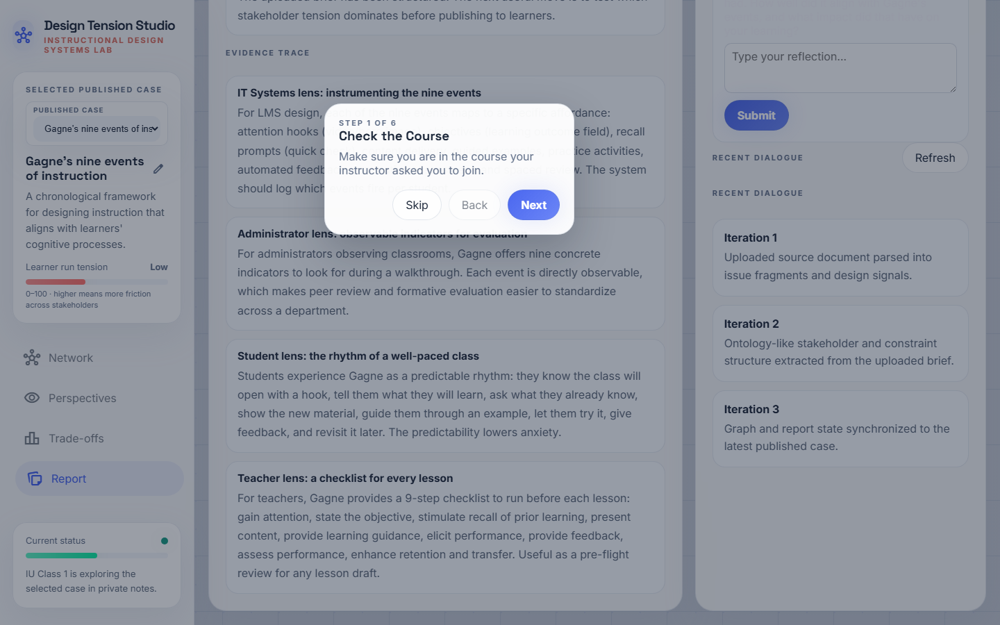

# Swarm_ID — Student Guide (English)

A step-by-step walkthrough for students using Swarm_ID during a class
session. Each step shows **what you will see**, **what to click**, and
**what is happening inside the system** — so you can understand the
swarm, not just operate it.

> **What you are doing here.** You are designing an online lesson.
> Swarm_ID is your "second brain" — when you ask a question, **five
> different stakeholders** (a teacher, a student, an IT specialist,
> an administrator, an accessibility expert) answer **at the same
> time**. You then see where they **agree**, where they **disagree**,
> and decide what *you* want to do with the tension. Every node you
> see carries a badge that tells you who wrote it: `AI` (one of the
> agents), `Me` (you), `Peer` (a classmate), or `Brief` (the original
> case).

---

## Step 1 · Sign in

Go to **https://swarmid.vercel.app** and sign in with the account
your instructor provided. If your instructor gave you a course or
join code instead of an account, enter it on the landing screen.

**What the system is doing:** authenticating you through Supabase
and loading your cohort context so you see the same course and
cases as your classmates.

---

## Step 2 · Onboarding card

First-time students see a **"Welcome to Swarm_ID"** card at the top
of the Studio. It lists four quick moves:

1. Pick a published case.
2. Read the case brief and look at the map.
3. Ask a question — the swarm answers from 5 lenses.
4. Add your own agenda nodes and challenge the ones you disagree with.

Dismiss the card once you have read it — it will not come back for
the same student account.

---

## Step 3 · Pick a case

Scroll the **Start here** panel to find the **Course cases** list.
Only cards tagged **Published** are available to students. Click
**Open case** on the one your instructor pointed you to.

**Tip.** If the list is empty, the instructor has not published a
case yet — let them know.

---

## Step 4 · Case map

The canvas now shows the case as a network:

- A center **core** node with the case title.
- Five stakeholder nodes orbiting it (Teacher, Student, IT,
  Administrator, Accessibility).
- Signal nodes (goals, constraints, evidence) connected to the
  relevant stakeholder.

Read the case brief in the left panel first. Every node has a small
**provenance badge** in its top-right corner — `Brief` means this
content came from the original case document.

---

## Step 5 · Ask your first question

At the bottom of the canvas is a composer input:
**"Ask a Question"**. Type something you genuinely want to think
about — e.g.

> *"How do student autonomy and teacher review load collide in this
> design?"*

Hit enter. Do **not** hit it twice — one click launches a swarm
round, which costs five Gemini calls in parallel.

**What the system is doing:** your question is sent to *all five*
stakeholder agents simultaneously. Each agent answers from their own
perspective — that is the swarm.

---

## Step 6 · Swarm round — 5 answers

Within 5–8 seconds you see **five new nodes** added to the network —
one per stakeholder — with `AI` provenance badges. In the
**Swarm activity** sidebar the `round` counter increments by 1, and
in the chat you see five messages, each labeled with a stakeholder
name.

**Read them side by side.** The whole point of a swarm is that
nobody's answer is "the" answer — they disagree, sometimes sharply.

---

## Step 7 · Disagreement edges

A few seconds after the five answers arrive, a second pass classifies
every pair as **agree / disagree / tangential**:

- **Green solid line** = agents agree.
- **Red dashed line** = agents disagree — *this is where learning
  lives*.
- **Gray dotted line** = tangential (they are talking past each
  other).

Click the `ⓘ` button next to the round counter to see the legend.
**Focus on red dashed lines.** Those are the genuine design tensions
you will have to resolve in your lesson plan.

---

## Step 8 · Challenge one lens

In the chat, each swarm response has a small **"Challenge this
lens"** button. Click it to push back — the system will prompt you
for a challenge sentence (e.g. *"That ignores our 40-minute class
limit"*), then it sends the original answer + your challenge back
to that same agent. You get a **round-2 refined response** from
that specific stakeholder.

**Why this matters:** this is where you stop being a passive reader
of AI output and become a co-designer. Your challenge shapes the
next answer.

---

## Step 9 · Add your own agenda node

The **Selected lens** panel (right side) has an **"Add to map"**
form. Give your node a short title, optionally a body. When you
submit, the node appears on the canvas with a `Me` badge — that is
how you show up in the shared cohort map.

**Classroom rule of thumb:** aim for at least 2–3 `Me` nodes per
session. Those are your design decisions, not the AI's.

---

## Step 10 · Report & personal reflection

Click **Report** in the left navigation. The report pulls together
your decisions, the swarm rounds you ran, and the evidence attached.
This is what you can hand in or paste into your lesson-plan draft.

---

## Step 11 · Export / close out

Use **Download PNG** to save the current network as an image (good
for slides), or **Download HTML Snapshot** to get a standalone
offline copy of the map in its current state.

Sign out when you are done — your work is saved server-side via
Supabase, so you can pick up where you left off next class.

---

## Troubleshooting

| Symptom | Likely cause | Fix |
|---|---|---|
| Nothing happens after I hit "Ask" | Offline or Gemini quota exhausted | Check your wifi, then ask the instructor |
| Only my question appears, no 5 answers | Swarm round failed silently | Open browser console, look for `runSwarmRound` warnings |
| Red disagreement lines never show up | Second classifier pass failed | Reload the page and ask the question again |
| Challenge button does nothing | You closed the prompt dialog | Click the button again and actually type a challenge |
| I can't see the course case | The case is in Draft | Your instructor has to publish it |

---

## How to get the most out of a session

1. **Write a real question.** "What's hard?" is weak — "How does
   teacher review time collide with student autonomy in my 40-min
   class?" is strong.
2. **Read all five answers before reacting.** Do not collapse into
   "the AI said..." — there is no single AI voice here; there are
   five.
3. **Challenge at least one lens.** Turn-taking is where actual
   learning happens.
4. **Add your own nodes.** A map full of `AI` badges with no `Me`
   badges means you have not taken a position yet.
5. **Export at the end.** Your instructor can see activity, but the
   report is easier to review than the raw map.
