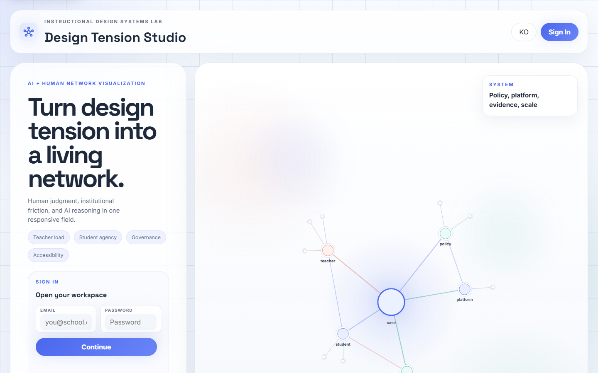
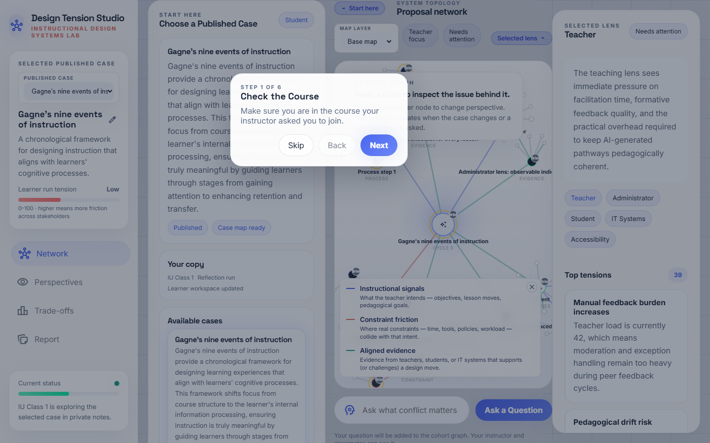
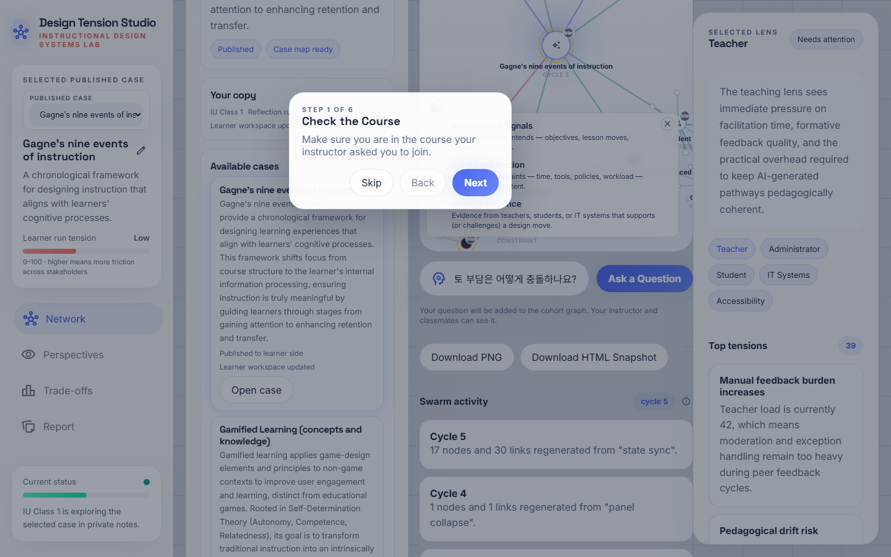
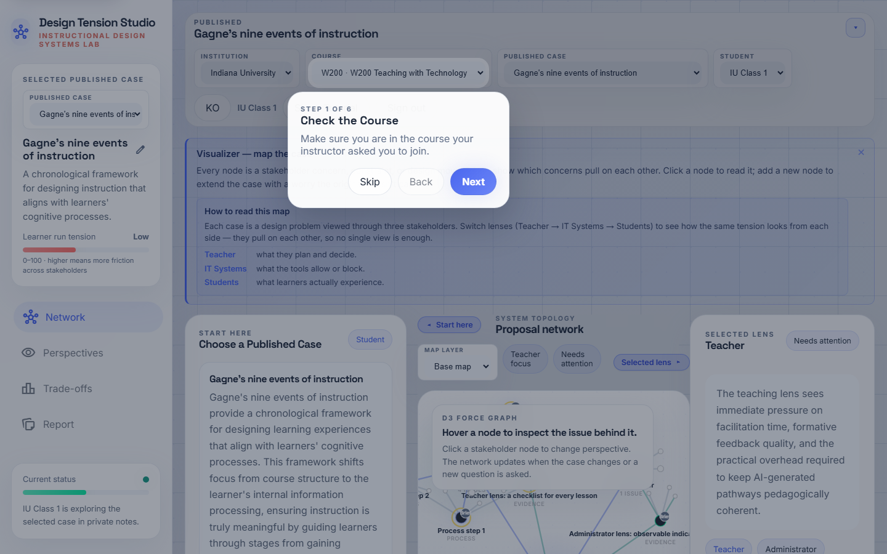
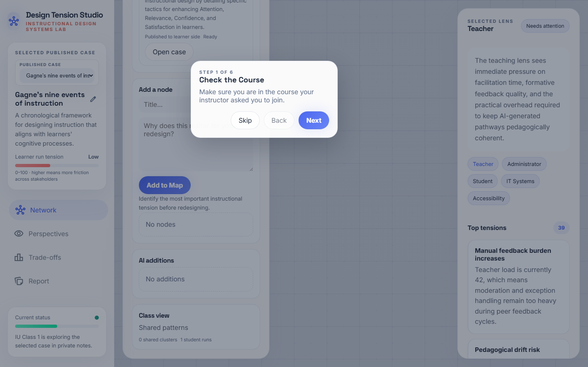

# Swarm_ID — 학생용 가이드 (한국어)

수업 시간에 Swarm_ID를 사용하는 학생을 위한 단계별 안내서입니다.
각 스텝은 **무엇이 보이는지**, **무엇을 클릭하는지**, **시스템
내부에서 어떤 일이 일어나는지**를 함께 설명합니다 — 스웜을
단순히 조작하는 것을 넘어 이해하도록.

> **지금 뭘 하는 거야?** 여러분은 온라인 수업을 설계하고 있고,
> Swarm_ID는 여러분의 "보조 두뇌"입니다. 질문을 던지면 **다섯
> 명의 이해관계자**(교사·학생·IT 전문가·행정가·접근성 전문가)가
> **동시에** 답합니다. 그리고 여러분은 그들이 어디서 **동의**하고
> 어디서 **이견**을 보이는지 확인한 뒤, 그 긴장을 **스스로**
> 어떻게 다룰지 결정합니다. 맵의 모든 노드에는 누가 쓴 내용인지
> 알려 주는 배지가 달립니다: `AI`(에이전트 중 하나), `나`(여러분),
> `동료`(반 친구), `설명`(원본 케이스).

---

## Step 1 · 로그인

**https://swarmid.vercel.app**에 접속해 강사가 제공한 계정으로
로그인합니다. 계정 대신 강의 코드나 조인 코드를 받았다면
랜딩 화면에 입력하세요.

**내부 동작:** Supabase로 인증하고 여러분의 코호트 컨텍스트를
불러와 반 친구들과 같은 강의·케이스를 볼 수 있게 합니다.

---

## Step 2 · 온보딩 카드

처음 접속한 학생은 스튜디오 상단에 **"Swarm_ID에 오신 걸
환영합니다"** 카드를 보게 됩니다. 네 가지 빠른 동작이 안내됩니다:

1. 게시된 케이스를 고르세요.
2. 설명요약을 읽고 맵을 살펴보세요.
3. 질문을 던지세요 — 스웜이 5가지 관점에서 답합니다.
4. 여러분만의 아젠다 노드를 추가하고, 납득이 안 되는 관점은
   "Challenge"로 반박하세요.

읽은 뒤에는 카드를 닫으세요 — 같은 학생 계정에서는 다시 뜨지
않습니다.

---

## Step 3 · 케이스 선택

**시작하기** 패널을 스크롤해 **강의 케이스** 목록을 찾으세요.
**게시됨** 태그가 붙은 카드만 학생에게 열려 있습니다. 강사가
지정한 카드의 **케이스 열기**를 누르세요.

**팁.** 목록이 비어 있다면 강사가 아직 게시를 안 한 상태입니다 —
강사에게 알려 주세요.

---

## Step 4 · 케이스 맵

캔버스가 케이스를 네트워크로 표시합니다:

- 케이스 제목을 담은 중앙 **코어** 노드
- 코어를 둘러싼 5명의 이해관계자 노드(교사·학생·IT·행정·접근성)
- 각 이해관계자에 연결된 시그널 노드(목표·제약·증거)

먼저 왼쪽 패널에서 케이스 설명요약을 읽으세요. 모든 노드의
오른쪽 위에는 작은 **출처 배지**가 있습니다 — `설명` 배지는
원본 케이스 문서에서 가져온 내용이라는 뜻입니다.

---

## Step 5 · 첫 질문 던지기

캔버스 하단에 컴포저 입력 필드가 있습니다: **"질문하기"**. 진짜로
생각해 보고 싶은 것을 입력하세요 — 예를 들어:

> *"이 수업에서 학생 자율성과 교사 검토 부담은 어떻게 충돌
> 하나요?"*

엔터를 치세요. **두 번 치지 마세요** — 한 번의 전송이 병렬로
5번의 Gemini 호출을 일으키는 스웜 라운드를 실행합니다.

**내부 동작:** 여러분의 질문이 **다섯 명의 이해관계자 에이전트
모두에게 동시에** 보내집니다. 각 에이전트는 자신의 관점에서
답합니다 — 이게 바로 스웜입니다.

---

## Step 6 · 스웜 라운드 — 5개의 답

5~8초 안에 **5개의 새 노드**가 네트워크에 추가됩니다 — 각 이해
관계자마다 하나씩, `AI` 출처 배지를 달고. **스웜 활동**
사이드바의 `라운드` 카운터가 1 올라가고, 채팅에는 이해관계자
이름으로 라벨링된 5개의 메시지가 보입니다.

**5개를 나란히 읽으세요.** 스웜의 핵심은 어느 한 답이 "정답"이
아니라는 점입니다 — 그들은 이견을 내고, 때로는 날카롭게
부딪힙니다.

---

## Step 7 · 이견 엣지

5개 답이 도착한 몇 초 뒤, 2차 패스가 답변 쌍을 **동의 / 이견 /
부분일치**로 분류합니다:

- **초록 실선** = 에이전트 동의.
- **빨강 점선** = 에이전트 이견 — *배움이 일어나는 곳*.
- **회색 점점선** = 부분일치 (서로 엇갈리는 이야기).

라운드 카운터 옆 `ⓘ` 버튼을 누르면 범례가 보입니다. **빨강 점선에
집중하세요.** 여러분이 수업 계획에서 해결해야 할 진짜 설계
긴장입니다.

---

## Step 8 · 한 관점에 도전하기 (Challenge)

채팅의 각 스웜 응답 옆에 작은 **"이 관점에 도전"** 버튼이 있습니다.
누르면 시스템이 도전 문장을 입력하라고 물어봅니다 (예: *"그건
40분 수업 제약을 무시한 이야기예요"*). 그러면 원래 답변 + 여러분의
도전 문장이 같은 에이전트에게 다시 전달되고, 그 이해관계자로부터
**2라운드 정교화 응답**을 받습니다.

**왜 중요한가:** 여기서 여러분은 AI 결과를 수동적으로 읽는
소비자에서 벗어나 공동 설계자가 됩니다. 여러분의 도전이 다음
답을 만듭니다.

---

## Step 9 · 나만의 아젠다 노드 추가

오른쪽 **선택된 렌즈** 패널에 **"맵에 추가"** 폼이 있습니다.
짧은 제목과 선택적 본문을 입력해 제출하면, 캔버스에 `나` 배지를
단 노드가 나타납니다 — 이게 여러분이 공유 코호트 맵에 등장하는
방식입니다.

**교실 기준.** 세션당 최소 2~3개의 `나` 노드를 목표로 하세요.
그게 여러분의 설계 결정이고, AI의 결정이 아닙니다.

---

## Step 10 · 리포트 & 개인 회고

왼쪽 내비게이션의 **리포트**를 클릭하세요. 리포트는 여러분의
결정, 실행한 스웜 라운드, 첨부한 증거를 모아 정리합니다.
과제로 제출하거나 수업 계획 초안에 붙여 넣을 수 있는 결과물이
됩니다.

---

## Step 11 · 내보내기 / 마무리

**PNG 다운로드**로 현재 네트워크를 이미지로 저장(슬라이드용)
하거나, **HTML 스냅샷 다운로드**로 현재 상태의 독립형 오프라인
맵을 받으세요.

마치면 로그아웃하세요 — 작업은 Supabase를 통해 서버에 저장되어
있어 다음 수업에서 이어서 진행할 수 있습니다.

---

## 문제 해결

| 증상 | 원인 추정 | 조치 |
|---|---|---|
| "질문하기"를 눌렀는데 반응이 없음 | 오프라인 또는 Gemini 쿼터 소진 | 와이파이 확인 후 강사에게 보고 |
| 내 질문만 보이고 5개 답이 안 옴 | 스웜 라운드가 조용히 실패 | 브라우저 콘솔에서 `runSwarmRound` 경고 확인 |
| 빨강 이견 선이 전혀 안 나타남 | 2차 분류 패스 실패 | 페이지 리로드 후 다시 질문 |
| 도전 버튼이 반응 없음 | 프롬프트 창을 닫아 버림 | 다시 누르고 이번엔 실제로 도전 문장을 입력 |
| 강의 케이스가 안 보임 | 초안 상태 | 강사가 게시해야 함 |

---

## 수업에서 최대한 뽑아내는 법

1. **진짜 질문을 쓰세요.** "뭐가 어렵지?"는 약합니다. "40분 수업
   에서 교사 리뷰 시간은 학생 자율성과 어떻게 부딪히지?"는
   강합니다.
2. **반응하기 전에 5개 답을 다 읽으세요.** "AI가 그랬다…"로
   뭉뚱그리지 마세요 — 여기엔 단일한 AI 목소리가 없고, 다섯
   목소리가 있습니다.
3. **최소 한 관점에는 도전하세요.** 턴테이킹이 일어나는 지점이
   실제 학습이 일어나는 지점입니다.
4. **여러분의 노드를 추가하세요.** `AI` 배지만 가득하고 `나`
   배지가 없는 맵은 여러분이 아직 입장을 잡지 않았다는 뜻입니다.
5. **마지막에 내보내세요.** 강사가 활동 내역을 볼 수 있지만,
   리포트가 원본 맵보다 훨씬 보기 쉽습니다.
