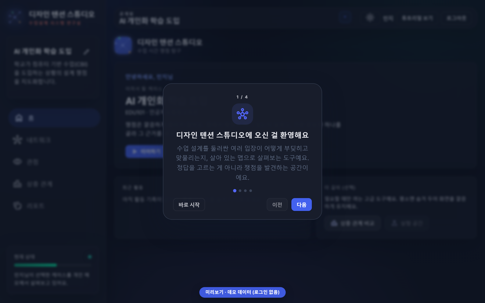
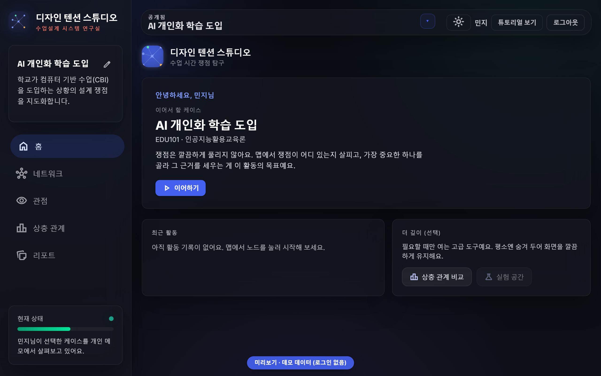
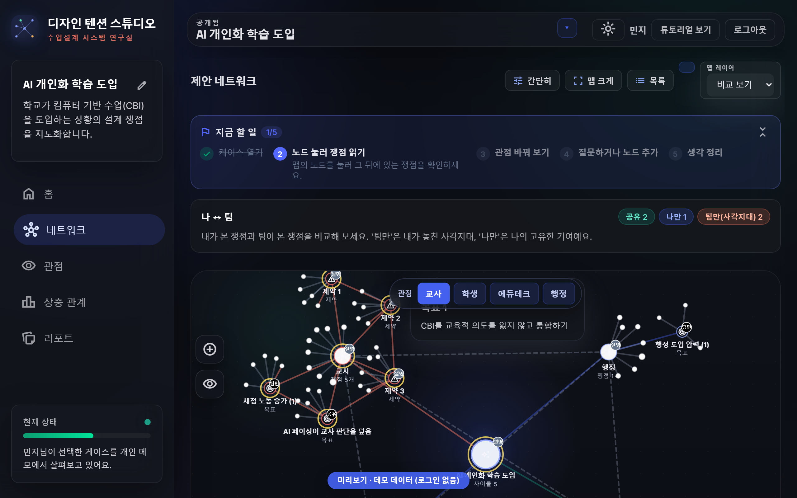
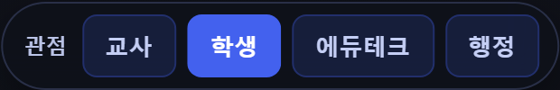
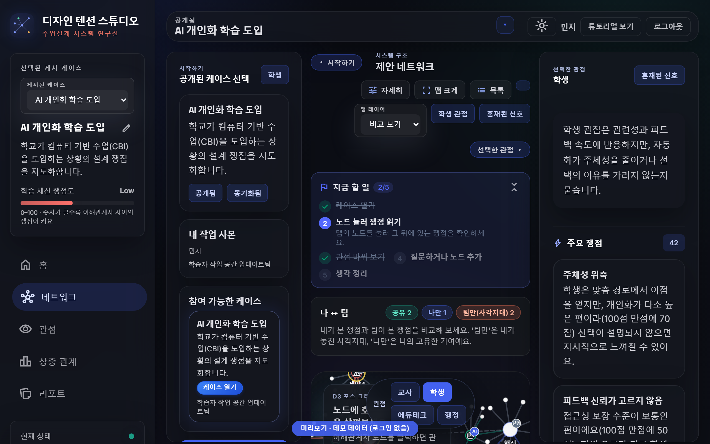
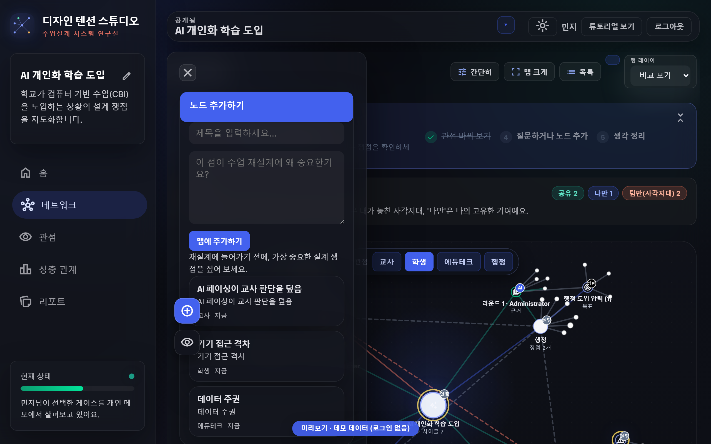
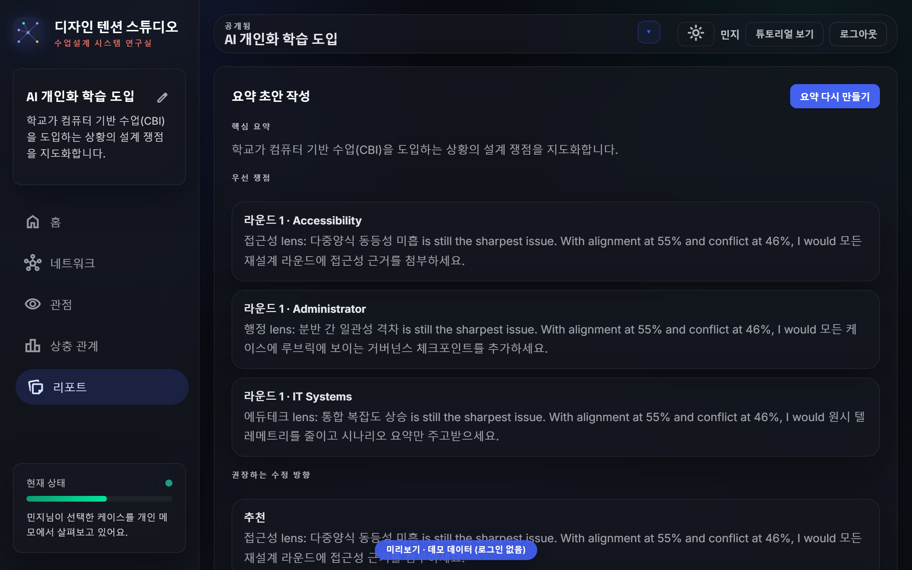

# 디자인 텐션 스튜디오 — 학생용 가이드

수업 시간에 디자인 텐션 스튜디오를 사용하는 학생을 위한 단계별 안내서입니다.
각 단계는 **무엇이 보이는지**, **무엇을 누르는지**, 그리고 **왜 그렇게
설계됐는지**를 함께 설명합니다.

> **지금 뭘 하는 거야?** 여러분은 수업 설계 사례 하나를 받아서,
> 그 설계를 둘러싼 **쟁점**을 찾아내는 중입니다. 같은 케이스도
> **교사 · 학생 · 에듀테크 · 행정** 네 입장에서 보면 다르게 보여요.
> 질문을 던지면 다섯 관점의 AI 에이전트가 동시에 답하고, 여러분은
> 그들이 어디서 **동의**하고 어디서 **부딪히는지** 확인한 뒤,
> 가장 중요한 쟁점 하나를 골라 **근거를 들어** 정리합니다.
> 맵의 노드에는 출처 배지가 달립니다: `AI`(에이전트), `나`(여러분),
> `동료`(반 친구), `설명`(원본 케이스).

[audio](./audio/student-ko/00-intro.mp3)

---

## 1단계 · 접속과 로그인

[audio](./audio/student-ko/01-landing.mp3)

**https://swarm-id-ko.pages.dev** 에 접속합니다. 랜딩 화면 왼쪽에서
이 도구가 무엇을 하는지 3단계로 소개하고, 그 아래 카드에서 바로
로그인합니다.

- **처음이라면**: 카드 아래의 *"처음 오셨나요? 코스 코드로 참여"*
  를 눌러 이메일 · 비밀번호 · 교수자가 알려 준 **코스 코드**를
  입력하세요.
- **이미 참여했다면**: 이메일과 비밀번호만 입력하면 됩니다.

> **아이패드에서 앱처럼 쓰기**: Safari에서 접속한 뒤
> **공유 버튼(⬆️) → "홈 화면에 추가"** 를 누르면 홈 화면에
> 아이콘이 생기고, 주소창 없는 전체 화면 앱으로 실행됩니다.
> 한 번 설치하면 와이파이가 불안정해도 화면이 즉시 뜹니다.

---

## 2단계 · 첫 방문 안내

[audio](./audio/student-ko/02-welcome.mp3)

처음 들어오면 짧은 안내 슬라이드 4장이 나타납니다. 이 도구가
무엇인지, 네 가지 관점이 무엇인지, 오늘 할 일이 무엇인지 1분 안에
보여 줘요. 마지막 장에서 **"가이드 투어 시작"** 을 누르면 화면
요소를 하나씩 짚어 주는 투어가 이어집니다.

건너뛰어도 괜찮습니다 — 화면 위쪽의 **"튜토리얼 보기"** 버튼으로
언제든 다시 열 수 있어요.

---

## 3단계 · 홈에서 이어하기

[audio](./audio/student-ko/03-home.mp3)

로그인하면 **홈** 화면에서 시작합니다. 진행 중인 케이스가 있으면
**"이어하기"** 한 번으로 바로 맵으로 돌아갑니다. 쟁점은 깔끔하게
풀리지 않아요 — 가장 중요한 하나를 골라 근거를 세우는 게 목표라는
것만 기억하세요.

---

## 4단계 · "지금 할 일" 따라가기

[audio](./audio/student-ko/04-task-banner.mp3)

맵 화면 위에는 **지금 할 일** 안내가 떠 있습니다. 다섯 단계 —
**케이스 열기 → 노드 눌러 쟁점 읽기 → 관점 바꿔 보기 → 질문하거나
노드 추가 → 생각 정리** — 를 실제로 수행하면 자동으로 체크되고,
다음에 할 일이 항상 강조돼요. 접어 두고 싶으면 오른쪽 버튼으로
한 줄로 줄일 수 있습니다.

---

## 5단계 · 맵 읽는 법

[audio](./audio/student-ko/05-map-read.mp3)

맵의 **노드 하나가 쟁점 하나**입니다. 노드를 누르면(또는 마우스를
올리면) 그 쟁점의 설명이 떠요. 아이패드에서는 **탭하면 설명이
고정**되고, 빈 곳을 탭하면 닫힙니다.

- **색**: 보라 = 수업 설계 신호, 빨강 = 제약 충돌, 초록 = 근거
- **이해관계자 사이의 점선**: 두 입장의 쟁점이 같은 유형에서
  맞물린다는 뜻입니다 — 한쪽의 결정이 다른 쪽의 부담이 되는 지점
- **배지**: 노드를 누가 만들었는지 (`AI` / `나` / `동료` / `설명`)

화면이 좁으면 **"맵 크게"** 버튼으로 양쪽 패널을 접고 맵만 크게
볼 수 있어요.

---

## 6단계 · 관점 바꿔 보기

[audio](./audio/student-ko/06-lens-bar.mp3)

맵 아래 **관점 버튼**(교사 · 학생 · 에듀테크 · 행정)을 누르면 같은
케이스가 그 입장에서 다시 읽힙니다. 강조되는 노드가 달라지고,
오른쪽 패널의 주요 쟁점도 바뀌어요. **적어도 두 개 이상의 관점**으로
케이스를 읽어 보세요 — 한 면만 봐서는 쟁점이 안 보입니다.

---

## 7단계 · 질문하고 응답 받기

[audio](./audio/student-ko/07-swarm-round.mp3)

맵 아래 **질문하기** 입력창에 궁금한 점을 쓰면, 다섯 관점의
에이전트가 **동시에** 답합니다. 응답은 맵에 새 노드로 나타나고,
에이전트끼리 **의견이 갈리면 빨간 선**으로 표시돼요 — 그 지점이
바로 토론할 가치가 있는 쟁점입니다.

오른쪽 **활동 내역** 패널에는 의미 있는 사건만 기록됩니다:
라운드 응답 완료, 이견 감지, 내 노드 추가, 동료 활동 등.
내가 한 일이 맵에 어떻게 반영됐는지 여기서 확인하세요.

---

## 8단계 · 내 노드와 메모 추가

[audio](./audio/student-ko/08-add-node.mp3)

왼쪽 아이콘(⊕)을 누르면 **노드 추가** 패널이 열립니다. 원본
케이스에 빠져 있다고 생각하는 우려나 질문을 짧은 제목으로
추가하세요. 여러분의 노드는 맵에 `나` 배지로 나타나고, AI가
관련 쟁점을 이어 붙여 줍니다.

노드를 선택한 상태에서는 **메모**도 남길 수 있어요 — "나만 보기"
또는 "학급 보기"(반 전체 공개)를 고를 수 있습니다.

---

## 9단계 · 목록으로 보기

[audio](./audio/student-ko/09-list-view.mp3)

맵이 한눈에 안 들어오면 **"목록"** 버튼으로 같은 쟁점들을 목록으로
볼 수 있습니다. 검색하고, **관점별 · 유형별 · 이름순 · 출처별**로
정렬하고, 행을 누르면 해당 노드가 선택돼요. 맵과 목록은 같은
내용의 두 가지 보기입니다.

---

## 10단계 · 학급 보기로 비교하기

[audio](./audio/student-ko/10-class-view.mp3)

**맵 레이어**를 "학급 보기"로 바꾸면 반 친구들이 추가한 쟁점이
모여 보입니다. 여러 명이 반복해서 지적한 쟁점은 "(N명)"으로
묶여요. "비교 보기"에서는 **나만 본 쟁점**(고유 기여)과 **팀만
본 쟁점**(내 사각지대)이 구분됩니다.

같은 케이스를 열어 둔 친구가 있으면 화면 위에 **"함께 보는 중
N명"** 이 뜨고, 친구의 노드가 **실시간으로** 내 맵에 나타납니다.

---

## 11단계 · 생각 정리 제출

[audio](./audio/student-ko/11-report.mp3)

**리포트** 화면에서 마무리합니다. 지금까지 맵에서 발견한 쟁점과
근거가 요약돼 있고, **생각 정리 질문**에 답해 제출하면 교수자에게
전달됩니다. 좋은 생각 정리의 기준은 하나예요 — *가장 중요한 쟁점
하나를 고르고, 맵에서 본 근거로 그 선택을 설명했는가.*

---

## 자주 묻는 것

- **화면이 복잡해요** → 기본 "간단히" 모드를 유지하세요. "자세히"는
  과정 데이터가 더 필요할 때만 켜면 됩니다. "맵 크게"로 패널을
  접는 것도 도움이 돼요.
- **야간/주간 모드** → 오른쪽 위 ☀/☾ 버튼으로 바꿉니다.
- **내가 한 게 저장됐나요?** → 활동 내역에 기록이 떴다면 저장된
  것입니다. 노드 · 메모 · 생각 정리는 계정에 저장되어 다른
  기기에서 로그인해도 이어집니다.
- **튜토리얼을 다시 보고 싶어요** → 화면 위 "튜토리얼 보기" 버튼.
